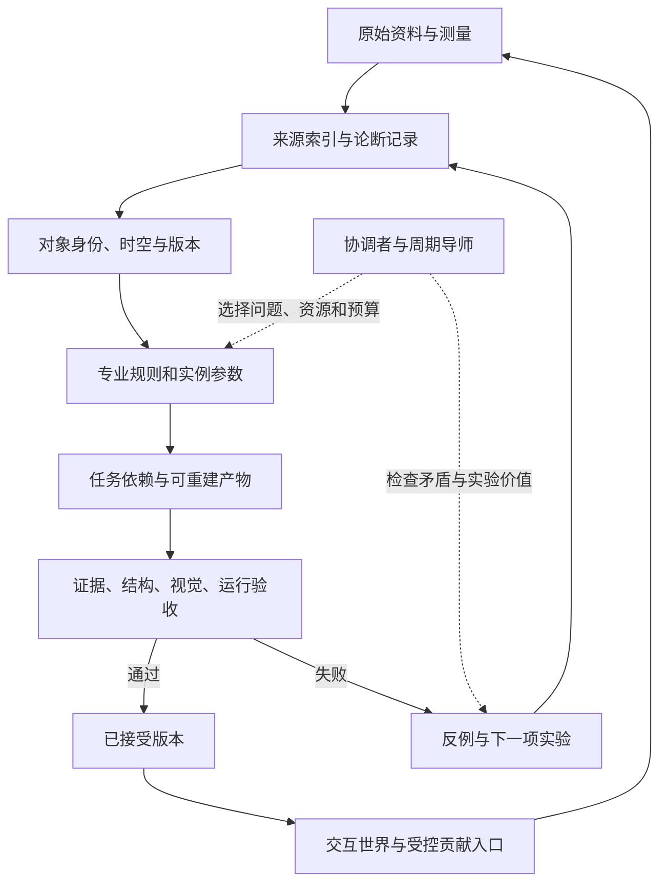

# Mother System：给小妈的完整研究与复核

V1.1 · 2026-09-05。本文合并全部主要意见、第二次复核、工作安排、资料导航、风险、协议和存储分析。第二次复核已直接改入各章节；原始资料与校验记录在附件中。先了解下一步可读 [小妈先读](00_小妈先读.md)。


---

## 第二次复核：结论的依据、限制和修订

V1.1 · 2026-09-05。复核重点是第一版判断是否有足够依据、建议是否造成不必要的工作，以及交接是否方便。没有把“重新思考”记成已经运行新的 Mother 生产实验。

### 1. 对“是否经过严肃思考”的回答

第一版确实做了原包逐文件阅读、原始技术资料核查、有限本地案例阅读及合成压缩对照，论证不是只靠复述愿景。但认真研究也不能让未验证的系统设计自动成为事实。第二次复核保留有直接依据的结论，同时修改了过强的优先级和执行要求。

尤其需要承认：原研究包描述的是方向、协议和自报失败，没有给出全部实现。它足以支持协议评审，不能支持对整个系统当前瓶颈的确定性诊断。

### 2. 哪些结论目前有多强的支持

| 结论 | 依据类型 | 可支持的范围 | 不能据此推出 |
|---|---|---|---|
| 原包 14 个文件已读，manifest 的 13 个内容文件相符 | 实际目录、逐文件读取、CRC 与散列 | 这个输入包的内容与完整性 | 原包之外的全部附件也已读 |
| 原记忆协议把复核、采用和生命周期放在同一状态列表 | 原文可直接核对，见 `input/MEMORY_AND_HANDOFF_PROTOCOL.md:43–53` | 协议表达容易歧义，需要澄清 | 实际数据库必然按同一方式实现，或已经因此发生事故 |
| 固定用途下的关键结构错误应独立检查 | 工程判断，结合包内失败描述 | 为错误建立清楚的诊断和接受边界 | 加几条检查就会让模型懂所有结构 |
| 60 km²、1 m 网格、float32 单层载荷可达 240 MB | 明确假设下的算术 | 文件大小必须结合面积、采样与类型理解 | 当前真实 DEM 的范围、冗余和压缩比已被测得 |
| 差分预测在两组合成数组上收益不同 | 已运行的有限演示 | 不能假定一种预测编码总会更小 | 已验证地理语义蒸馏，或已找到真实 DEM 的最佳编码 |
| 应先选有限生产问题做修正与保持验证 | 与当前材料相容的行动建议 | 提供一次低成本诊断的起点 | 是唯一最佳路线，或应暂停其他已有依据的工作 |
| 多 Mother 协作能否提高质量和效率 | 仍需项目实验 | 可以设计比较和明确成本 | 角色数量或会议次数本身就证明提升 |

### 3. 直接改入正文的内容

#### 3.1 瓦片优先级收紧

第一版虽注明了范围限制，但摘要仍把瓦片写成优先路线，容易让当前工作目录替代全系统选择。V1.1 改为根据现有清单比较证据可取得性、正确参照、反复失败、修改成本和真实依赖。瓦片作为候选，既有更成熟的案例可直接使用。

选试点不需要先审计全部仓库或补齐二十项能力。用小妈已有的信息作有限选择，保留选择理由，避免为了选择小试点又启动大型研究项目。

#### 3.2 用阶段取代无依据的日历承诺

本次不知道团队投入、设备和资料取得时间，不能给“七天全部完成”附上可信的工时估算。V1.1 把它改为七个工作阶段，可合并、按需要选择。月度和年度数量降为规划情景；等一轮真实工作的成本出现后再估算。

固定样本 10/10 之类的数字也只是检查某些既定问题是否生效。它不能支持真实错误率已足够低的结论。检索、人评与视觉检测都需另留新问题，并分别记录漏报、误报和无法判断项。

#### 3.3 分开“检查有效”与“模型有能力修正”

第一版强调流程修复有价值，但实际失败也可能来自输入信息不足、观察能力有限或生成工具表达受限。流程可以发现这些限制，不能承诺消除限制。

建议用一个已有正确参照的真实失败做诊断：

| 情况 | 区分它的检查 | 下一步 |
|---|---|---|
| 原件不足或本来不显示关键部分 | 对照原图/实物/文档，确认关键属性是否可见 | 补测量或来源，相关结论保持未知 |
| 原件有答案但任务没读到 | 核查任务实际检索结果与已知正确来源 | 修检索、别名、引用和上下文传入 |
| 图像比较的相机或尺度不一致 | 用标尺、对应点和固定投影检查 | 校准比较条件 |
| 观察者已得到清楚证据仍误读 | 用专业标注或独立测量指明错误位置与解释 | 降低自动判断范围，增加可检查的几何量或人工接口 |
| 解释正确但生成表示做不到 | 比较参数要求、中间结构和生成结果 | 调整表示或工具，不继续优化无关参数 |
| 中间产物正确而导出/显示错 | 比较同一数据在转换前后及目标运行环境 | 修单位、坐标、材质、导出或运行路径 |

这些是待做的诊断设计，不是已经对具体 Mother 得出的原因排序。

#### 3.4 减少协议对开工的负担

七类记录、四个状态轴和多层架构是可用的设计参考，不应要求每次小修改都填多份文件。第一次可以只有一页：目标与依据、修改前后、如何判断、结果与下一步。

确实出现重复引用、查找困难、依赖失效或多人写入冲突，再拆记录和引入索引。对重要论断区分事实支持和采用决定的原则保留；实现形式可以很轻。

#### 3.5 收紧验收措辞

固定坏样本有意义的前提，是预期结果本身有依据。如果支承规则尚未证实，最多只能验证“代码遵守这个假设”，不能验证真实历史支承正确。

每个坏样本配一个确定有效的对照，后者误拒也视为失败。固定规则检查通过后，另用未参与调参的真实对象检查更广范围的适用性。只有同一对象的新视角时，结论限于多视一致性。

#### 3.6 保持资源导航与技术证明的区别

36 项资源有不同深度：标准或技术段落可以支持具体设计概念；目录和产品页只能支持去哪里继续找。V1.1 明确标注这一差别，不以资源数量作为研究质量指标。首轮已核查的来源保留，未声称本轮又把所有书籍与网站完整读了一遍。

#### 3.7 交付只需一个包

全部成果集中于当前 ZIP；给小妈的入口在最前，正文另合为一份，原文、结果、示例和脚本作为附件保存。本文写作中的协调者称呼统一为“小妈”。原始输入保留原文与散列，不为改称呼而改写原件。

### 4. 修订后仍然坚持的建议

重要论断保留来源和适用范围；团队采用与事实支持分开；已接受版本可恢复；用清楚的错误参照检查修正；为宣称可复用的方法设置新任务验证；历史观测与场景补全分开；计算数据成本时明确恢复目标和完整依赖。

这些建议适合先用已有工具小范围验证。它们的价值要体现在更少返工、更清楚的错误诊断、稳定恢复和实际迁移收益上。

### 5. 下一轮最有价值的输入

一个实际失败样本和明确的正确参照；该任务实际读到的材料；一次有限修正的前后产物与检查结果；所花时间；一个未参与调参的后续样本。拿到这些后，才更有条件判断系统主要卡在感知、表示、执行、检索还是协作。


---

## Mother System：完整评审

### 1. 先给结论

**建议继续，下一轮先在现有生产任务中诊断一处反复出现的错误，再用有限试验验证修正、保存和复用。** 阶段目标是减少同类返工，让新证据正确影响相关产物，并观察方法在不同任务上的效果。具体试点与投入应依据实际资产、证据和阻塞状况决定。

这不是否定长期愿景。历史世界、地方知识保存和程序化生产可以共享一套证据体系；它们也需要各自的验收标准和推进节奏。把它们一开始全部绑成一个总工程，会让任何一处未完成都变成整个系统的障碍。

本次材料充分表达了愿景和问题，但未提供足够生产证据来判断全部 Mother 的实际水平。下文的系统性风险是对设计的评审，不是声称已经测出所有仓库的缺陷。

### 2. 应当保留的五个核心

| 应保留的方向 | 为什么有价值 | 需要补上的工程条件 |
|---|---|---|
| 时间、地点、对象身份 | 抑制把通用形象冒充地方或历史事实 | 增加单位、坐标系、适用范围、证据年代；未知可为空 |
| 观察、证据、假设、验证 | 给生成建立可追溯的出发点 | 每轮必须有可否证预测和外部检查结果 |
| 压缩后能回到细节 | 防止摘要越写越确定、例外逐渐消失 | 原件、定位、散列、版本、推导关系可访问 |
| 结构与环境关系 | 能把对象组合成有联系的世界 | 区分拓扑关系、连续场和时间事件；控制耦合成本 |
| 人与专业代理互补 | 人的地方知识、取舍与审美很重要 | 用固定对照和明确决策减少人反复纠正同一问题 |

这些方向分别见原包 `SYSTEM_CANON.md:23–43,81–106`、`WORLD_LEARNING_MODEL.md:21–35,84–155`。相邻成熟实践也支持其中部分做法：文化遗产可视化已有强调来源评估、记录和可持续访问的原则，不必从零发明研究纪律。[London Charter](https://londoncharter.org/principles.html)

真正可能形成项目优势的，是把地方证据、生成规则、修正记录和可交互对象接起来，并证明一条修正可以稳定影响后续产物。这是一项待验证的产品与工程优势，不能仅凭当前概念包宣称算法突破。

### 3. 需要澄清的八个概念

#### 3.1 “学会了”需要观察得到的定义

建议区分四件事：查到了资料；把资料记入外部记录；修改了规则或工具；在未参与调参的新任务上表现更好。前两项不自动推出后两项。

普通修正先留下目标、关键依据、前后差异和结果；准备宣称某项方法可复用时，再补适用范围、反例和不同任务的迁移结果。没有迁移验证时，结论限于当前样本。不能因为一次修正没有迁移实验就否认它的价值，也不能把外部记录积累解释为底层模型权重已经被训练。

#### 3.2 对象身份稳定，关于它的认识可修订

原包希望在身份确定后遵守相应约束，方向合理；但“resolved”不应成为永不重开的结论。照片中的水、湿石、冰或反光表面，可能需要新证据才能消歧。对象状态也可能包含混合相或随时间发生转变。

建议保存 `identity_hypothesis`、支持证据、反证和重开条件。当前采用的解释用于本轮计算；出现反证时，重新检查它并使依赖它的输出失效。保留互斥候选，不把它们平均成一个物理上不存在的对象。

#### 3.3 事实、团队决策和流程状态应分开

`MEMORY_AND_HANDOFF_PROTOCOL.md:43–53` 把 `VERIFIED`、`ACCEPTED_CANON`、`SUPERSEDED` 放在同一列表。它们分别描述证据支持、团队采纳和版本生命周期；一个条目可以同时具有这三个属性。

建议至少拆成：认识状态、复核状态、生命周期、采用决策。比如“尺寸仍属推断，但团队允许用于远景原型”完全合理；不能把这次允许改写为“尺寸已验证”。原包中 FACT/INFERENCE 和 ESTABLISHED/PROPOSAL 等术语也应统一映射，避免不同 Mother 各自解释。

#### 3.4 视觉相似、历史依据、结构合理与运行性能独立验收

一段屋面即使渲染漂亮，也可能搭接错误；即使有历史依据，也可能无法在目标设备运行。验收应采用多项门槛，关键失败不得靠别的分数补偿。

建议记录五个维度：证据适用性、几何与结构、材料与动态、视觉表现、运行成本。普通道具与近景历史主资产可以使用不同标准，但标准必须在生产前写明。原型通过与历史生产发布通过需要不同状态。

#### 3.5 自我复查可以帮助发现问题，不能独立担保正确

更强的导师、多次对话和多个角色都不自动增加独立证据。共享同一错误材料的多个代理可能得到相同错误结论。

已有研究在特定推理任务上发现无外部反馈的自纠可能失效；另有研究通过专门强化学习改善自纠。这些结果不足以直接判定当前视觉任务的能力。项目应测自己的任务，而不是把早期论文结论永久化。[ICLR 2024 自纠研究](https://arxiv.org/abs/2310.01798)、[SCoRe](https://arxiv.org/abs/2409.12917)

建议把复核锚在测量、固定视图、独立原始来源、结构检查和人类盲评上。导师的职责是提出可检验的解释和实验，不是用更有说服力的文字替代实验。

#### 3.6 学习成熟系统时，要保留术语和实现对照

`PUBLIC_TECH_KNOWLEDGE_MAP.md:7–15` 建议去掉产品命名，抽取一般规律。过度去名会丢失可检索性、边界条件和操作语义。建议同时保留“通用概念、原产品术语、版本、输入输出、失效条件、适配实现”。

可以自己定义世界知识层，同时直接使用成熟几何库、文件格式、渲染器和调度方法。外部工具并不天然污染世界模型；没有清楚的接口才更容易造成耦合。许可和使用限制留在来源与依赖记录中，不能因抽象而丢失。

#### 3.7 生成规则不必替代所有网格、测量和局部残差

规则善于描述重复结构，测量善于保存某个真实实例的特殊性。把残差删掉、再用噪声补回来，可能得到同类对象，却失去原对象的信息。

建议采用“通用规则＋地方或型号配置＋实测约束＋实例修正”。不要求每个扫描对象都被压成一小段程序，也不把全部复杂度藏进一个未计费的大模型后声称数据只剩一个种子。精确恢复和有界近似分开，详见 [存储分析](details/06_DEM_AND_STORAGE.md)。

#### 3.8 长期智能研究与近期生产应保持清楚边界

`MOTHER_REGISTRY.md` 同时列出瓦、门窗、生态和 AI Brain/Jarvis。它们属于不同成熟度的工程问题。建议近期把 Brain 限定为任务状态、检索、预算、实验选择和结果归档；自主认知、普适世界模型、复杂社会行为保留研究路线。

“每 12 小时开会”也应先作为协调策略试验，比较其成本与收益。可以保留 12 小时的检查窗口，但以结构化变更摘要为主；没有依赖冲突或需要决策的内容时，不必让所有 Mother 互相复述状态。

### 4. 推荐架构：共同证据，专业规则，独立验收

以下是逻辑职责划分，全部为建议。先复用已有文件、工具和工作流；只有实际查找、协作或重建问题需要时，再增加索引与服务。六个逻辑边界不要求建设六套平台。



#### 4.1 六个边界

1. **原始证据库**保存照片、扫描、文档、测量、地图等原件和来源。OCR、裁切和转码是衍生物，不替换原件。
2. **论断与决定层**保存“谁基于什么，对哪个对象在何时提出了什么”。反证与支持证据均可查询。
3. **世界描述层**保存实例身份、部分、关系、事件、状态和所采用的假设版本。
4. **专业规则层**保存瓦作、木构、地貌、机械、物种等方法，明确输入、尺度、适用范围、未知参数和输出。
5. **构建层**把选定版本的数据与规则编译为场景、网格、材质、动画、碰撞和运行缓存。
6. **验收与发布层**记录测试与人工决定，并保持上一个已接受版本可回退。

小妈负责优先级、接口和冲突处理，不亲自维护所有领域事实，也不把所有中间产物挤进一段总摘要。Mother 是能力边界，可以由同一执行环境按任务调用；不需要每个名称都对应常驻代理。

#### 4.2 不要把三种图混成一张

| 图 | 例子 | 处理原则 |
|---|---|---|
| 证据推导图 | 某尺寸结论来自测量及相机标定 | 保存原件、定位、矛盾与推导；可追踪来源失效 |
| 构建依赖图 | 瓦宽改变后，阵列、UV、碰撞和测试需重建 | 输入版本和参数决定缓存是否有效 |
| 世界关系图 | 瓦被何物支承；建筑遮挡风雨；人使用门 | 关系可能形成反馈；由适用的求解器和时间步处理 |

构建任务可组织为有向无环图；世界中的双向作用不应强行塞入同样的无环假设。Houdini PDG 值得借鉴的正是任务、依赖、属性和增量重算，而非单纯节点外观。[SideFX PDG](https://www.sidefx.com/docs/houdini/tops/intro.html)

#### 4.3 最小技术选择

建议先复用现有版本控制、证据文件和少量结构化记录。实际出现反复找不到适用记录、跨任务查询或索引恢复需求时，可试用 SQLite 建可重建索引；不将新增数据库列为第一次修正的前置。若采用全文检索，要测试中文分词、别名、旧地名和编号；选了 FTS5 并不等于召回可靠。[SQLite FTS5](https://www.sqlite.org/fts5.html)

证据关系可参考 W3C PROV 的实体、活动、责任主体；历史事件可按需映射 CIDOC CRM；时空栅格来源索引可参考 STAC。不建议第一周完整实现三套标准。[PROV-O](https://www.w3.org/TR/prov-o/)、[CIDOC CRM](https://cidoc-crm.org/Resources/definition-of-the-cidoc-conceptual-reference-model-v7.1.1)、[STAC](https://github.com/radiantearth/stac-spec/blob/master/item-spec/item-spec.md)

资产创作与组合可在需要时适配 OpenUSD；运行交付按目标引擎使用 glTF/GLB 或其他产物。两者都不应单独承担全部知识记忆。OpenUSD 的层和变体适合非破坏组合；glTF 明确面向运行时资产交付。[OpenUSD](https://openusd.org/release/intro.html)、[glTF](https://www.khronos.org/gltf/)

先写小接口，把上述选择做成可替换适配器。避免同时新建图数据库、向量数据库、分布式调度器、世界编辑器和渲染引擎。

### 5. 把学习做成有停止条件的实验

#### 5.1 一轮需要回答的十个问题

以下是思考顺序，可以合并在一页任务记录中。按本轮用途选择必要检查，不要求每次小修改都新增十份记录或运行整套生产验收。

| 步骤 | 必须留下的内容 | 离开此步的条件 |
|---|---|---|
| 定义目标 | 对象、用途、观察距离、时间地点、预算 | 成功与失败有具体含义 |
| 检索旧记录 | 相关决定、禁用旧路、已接受版本、例外 | 说明哪些记录适用于本任务 |
| 整理证据 | 来源、定位、测量、单位、年代和质量 | 事实与缺口可见 |
| 分解对象 | 大形、部分、连接、材料、状态 | 关键结构有独立描述 |
| 提出候选 | 关键歧义保留 2–3 种解释 | 每个候选有区分它们的观察 |
| 选择实验 | 本轮只改什么、预计出现什么 | 结果可能推翻当前方案 |
| 生成最小样本 | 固定输入、种子、版本和相机 | 可复现检查过程 |
| 比较与否证 | 指标、固定对照图、结构与运行检查 | 能定位失败层次 |
| 固化或回退 | 结论、失败路线、产物与接受状态 | 无证据的变化不覆盖已接受版本 |
| 迁移验证 | 一个未参与调参的不同对象或任务 | 判断规则是否具有超出单样本的收益 |

学习可以包含快速生成探索：它是在验证一个清楚标记的假设。原包“学习在生成之前”若被解释为必须完全理解领域后才动手，反而会拖慢获得反馈。

同一对象的留出视角适合检查多视一致性，但不能单独证明方法已经迁移到另一种对象。两种评测分别记录。

#### 5.2 失败时先判断错在哪里

建议依次排查：目标理解 → 证据身份/年代 → 单位与相机 → 部分与连接 → 参数 → 材料与照明 → 导出与运行。诊断错误层级后再修改。镜头透视错误时增加几何细节，通常只是补偿错误。

停止当前路线的建议条件：出现硬约束反例；连续两次改动没有预先声明的新假设或新证据；连续三轮固定评测没有超出评测噪声的改善；超过本轮时间或成本预算；修复一处却重新引入已拒绝错误。停止后交付诊断、最佳保留版本和下一项能区分假设的实验，不能只留下“继续优化”。

这些阈值是首轮工作规则，应根据任务时长和评测波动调整。若缺证据，只阻断依赖该证据的真实性结论；不阻断无关的索引、相机工具或相对比例试验。

#### 5.3 测量真正的积累

建议月度记录：同类错误复发次数；每件达到验收的总成本；人重复解释同一约束的次数；关键结论能追到原件的比例；新证据引发正确重建的比例；迁移到新样本后保持通过的数量。分母、任务难度和版本必须相同或注明差异。

知识条目数、会议次数、提示词长度、生成图片数都可以计费和排查流程，但不应作为学习成功的主要指标。

建议首月增加一个小型对照：对相近难度的任务分别使用现有流程、加入结构化历史记录的流程、再加入独立验收的流程；固定输入与预算，记录旧错复发、实际接受率和总成本。训练/调参样本与评测样本分开，并轮换任务顺序。这有助于判断改善是否与记忆、评测或额外计算有关。小样本、任务难度差异和模型随机性仍会限制归因，应报告这些因素；结果用于决定下一次实验，不作普遍能力排名。

### 6. 视觉观察与形状蒸馏

#### 6.1 先诊断视觉错误的来源

检查、记忆和复核能提供反馈，不保证执行模型就能看懂或修好对象。对一个已有正确参照的失败样本，建议先区分：原始证据缺失；已有证据未检索到；相机/尺度不匹配；观察者看到了但解释错误；结构表示或生成工具表达不了；导出/渲染造成偏差。分别补证据、修检索、校准观察、加入明确测量或人工标注、修改表示/工具、排查运行转换。若只有专业人员或独立测量能判断某个关键点，就保留该检查接口，不继续依赖同一模型重复自评。

需要给观察提供可比较的输入：同一尺度、同一视角、同一照明，分别显示轮廓、深度、法线、构件编号和最终材质。用主视图判断大形，用背面、底面、剖面检查支承、厚度和连接。光照和纹理必须能够关闭。

本地瓦片样本提供了一个可考虑的起点，但尚未比较所有 Mother 的现有样本。2026-09-01 分析报告明确记录：真实比例未知，粗糙度没有直接依据，人工视觉和生产批准均为 false。本次查看了该报告及四视图，没有重新读取原 FBX。图像能提示重复曲面结构，但不能补出年代、真实厚度或安装规则。[随包保存的原分析报告副本](details/evidence/local_tiles_review_20260901.md)、[已有四视图副本](details/evidence/local_tiles_contact_sheet_20260901.png)

#### 6.2 统一描述外壳，允许不同领域采用不同几何

建议共同描述包含：身份与适用范围、坐标与尺度、部分图、约束、生成方法、参数、局部残差、材料、动作状态和证据引用。内部表示按对象选择：

| 对象 | 优先表示 | 不能省略的部分 |
|---|---|---|
| 瓦、砖、梁、门窗 | 截面、扫掠/放样、厚度与装配参数 | 支承、搭接、端部、净空、制造和地方变体 |
| 建筑 | 构件与空间图、轴网、局部参数规则 | 承接关系、交通路线、不同年代的改建事件 |
| 飞机和机械 | 型号配置、零件关系、曲面与关节约束 | 实际安装语境、坐标、碰撞包络与运动范围 |
| 大部分地表 | 实测高度场、矢量水系、多尺度残差 | CRS、垂直基准、NoData、边界与测量误差 |
| 岩石、洞穴、悬垂 | 网格或隐式面/SDF、局部细节层 | 高度场不能表示的多值垂直结构 |
| 植物 | 分枝与生长图、种属参数、几何实例 | 物种、环境、季节和年龄适用范围 |
| 人和动物 | 骨架、皮肤/体形、动作与接触状态 | 生物比例、关节限制、支撑相和环境交互 |

统一一种几何原语覆盖所有领域，会损失各领域最重要的信息。几何算法可借鉴成熟库；稀疏体积可借鉴 OpenVDB；它们提供表达和计算工具，不负责证明重建为真。[libigl](https://libigl.github.io/)、[OpenVDB](https://www.openvdb.org/)

#### 6.3 稀疏视图对应多个可检验三维假设

单张或少量图片通常无法唯一确定背面、内部和尺度。建议每次明确：哪些表面实际可见、哪些通过对称或制造假设补全、哪些仍未知。生成的多视图可以帮助表达候选，不构成新的实物观察。

有实拍条件时，优先补拍最能解决关键歧义的视角，附比例依据；不应仅增加相似正面照片。COLMAP 的文档也把足够重叠、不同观察位置和相机模型作为重建条件的重要部分。[COLMAP](https://colmap.github.io/tutorial.html)

#### 6.4 评测应分层并保留测试样本

建议先做 6–12 个小样本的校准集，再留出未参与调参的样本。它们用于发现流程问题，不足以证明整个世界系统已经泛化。每个样本保存正确例、已知错误例和常见混淆例。

几何可使用关键点偏差、轮廓误差、厚度区间、穿透和接触检查；历史依据使用来源与适用范围检查；动态使用动作边界和时间段；运行使用帧时间、内存与加载测量。人评时固定画面、随机左右位置，可选“分不出”并标注具体错误区域。

相机未匹配、遮挡不同或参考带畸变时，不能机械套用像素差。LPIPS 等感知相似度可以作为辅助定位工具，不能证明构造或年代正确。[LPIPS 原作者项目](https://richzhang.github.io/PerceptualSimilarity/)

先用故意缩放某个比例、删除一处支承、修改一个材料通道的坏样本检查评测是否真能报警。如果它只会对新旧产物都说“不错”，暂时不宜接入自动接受流程。

### 7. 材料、物理和环境关系

#### 7.1 材料分三层

**制作与结构**：基体、制造工艺、孔隙或纤维、层次、表面加工。**随时间变化的状态**：含水、积尘、裂损、修补、氧化或生长。**渲染参数**：颜色、法线、粗糙度等以及目标渲染器的映射。

这是推荐的数据设计。不能因为把它写成方程，就声称参数已获材料科学验证。PBR 资料适合学习光与表面的响应，不自动提供某种地方瓦材在多年风雨后的演化规律。[PBRT 第四版](https://www.pbr-book.org/4ed/contents)

建议用下述概念接口表示变化，不在没有数据时填造系数：

`下一状态 = 演化规则(当前状态, 环境输入, 暴露条件, 使用/维修事件, 时间步, 参数依据)`

`渲染参数 = 材料映射(结构, 当前状态, 观察尺度, 渲染器版本)`

“雨后更湿”的效果可以先实现为视觉近似，标明适用条件；若宣称物理模拟，就补充参数单位、初边值、量纲与守恒检查、数值稳定性及测量对照。三种成熟度建议分别叫“外观规则”“经样本校准的近似”“经相应实验验证的物理模型”。

#### 7.2 共享机制，不共享一个万能旧化贴图

材料库可以共享积尘、暴露、雨淋和修补的接口；地方、工艺、涂层和物种特征放在不同配置中。色差不能直接等同于年代；年龄也不应成为让所有表面同步变旧的唯一旋钮。

一组图像可能同时受照明、反射、颜色和几何影响。反演工具可以帮助拟合，但需要控制条件；拟合成功并不唯一证明真实材料成分。[Mitsuba 3](https://mitsuba-renderer.org/)、[逆渲染教程](https://mitsuba.readthedocs.io/en/latest/src/inverse_rendering/forward_inverse_rendering.html)

建议先让同一片屋面的干燥、湿润、遮蔽、局部维修四种状态通过一致性检查，再扩展复杂生物附着与多年老化。

#### 7.3 场、图、事件各自负责适合的事情

| 表达方式 | 合适用途 | 主要限制 |
|---|---|---|
| 连续场 | 湿度、温度、风速、光照、表面含水等空间量 | 必须说明单位、分辨率、边界和合成规则 |
| 关系图 | 支撑、包含、邻接、连接、使用和可通行性 | 关系本身不等于力学求解结果 |
| 事件与状态机 | 建造、维修、迁移、开门、破坏和复原 | 不能用连续平滑插值抹掉离散历史事件 |
| 个体行为模型 | 人或动物的目的、选择、接触和交互 | 密度场可作输入，但不足以完整描述意图 |

建议每类场指定一个权威生产者和统一坐标转换，防止 Weather 与 Material 各自计算“湿度”且含义不同。写明字段语义、单位、采样位置、时间步、误差和何时重算。主导影响先单向耦合；只有双向反馈确实影响验收时才加入迭代求解。

连续物理、离线缓慢老化和渲染帧率应解耦。不必每一帧计算每棵树对整个世界的生态影响。远近不同精度的仿真也需要边界过渡与状态保存。

### 8. 记忆怎样真正阻止复发

#### 8.1 长期记忆应该能回答具体问题

“我们以前为什么否定这个方案？”“这条规定适用于哪个建筑支系？”“哪份原件支持这处结构？”“新证据使哪些产物过期？”“上一次被接受的是哪个版本？”

建议把原包七层记忆整理为独立对象：原始来源、观察、论断、决定、试验、版本化产物、当前任务状态。领域记忆与公共技术记忆是检索视图和适用范围，不必各自复制同一事实。

摘要是入口，原件和记录是依据。向量相似结果只作为候选；关键约束先按对象 ID、类型、地方、年代和版本确定性检索，再展开相关来源及反例。

#### 8.2 决定必须有适用域和重开条件

旧失败记录应包含：当时输入、误解、失败检查、适用范围、替代方案、何种新证据允许重试。否则失败记忆会变成永久禁令，阻碍本来有效的不同场景。

建议 `canon` 主要保存价值与工程约定、经过审议的稳定决定。世界事实仍在可修订论断库中。新导师建议先进入候选决定，经过试验和采用记录，再成为团队约定；不要直接把此次评审压成不可争议的真理。

#### 8.3 依赖失效比“提醒别忘记”更可靠

举例：某片瓦的宽度依据被纠正。系统应标出依赖该宽度的排列、屋面覆盖、UV、碰撞与验收结果过期，并重建相关任务；与它无关的门扇材质无需重建。

已接受产物保持不可变，新的候选产物另存。通过全部必要门槛后，才切换当前接受指针。缓存键需包含证据与规则版本、参数、随机数算法、工具链、构建设置等影响输出的因素。相同种子本身不足以保证跨版本一致。

对数值几何、渲染图像分别约定复现方式；浮点和 GPU 渲染未必跨设备逐字节相同。可要求相同语义结果和误差容限，不应伪造完全确定性承诺。

#### 8.4 做两种恢复演练

第一次：从新会话仅凭交接包找回目标、旧决定、原始证据和最佳产物，并继续一个小修改。第二次：模拟索引丢失，从版本化记录重建索引。两种演练通过后，才有理由说记忆有助于持续工作。

同时记录记录时间与对象适用时间。例如 2026 年录入的证言可能描述 1944 年的修缮；后来发现年份有误时，保留“当时系统知道什么”的修订历史。

### 9. 历史世界与地理证据

#### 9.1 1940 年代可以作为目标，但数据准备有成本

现代 DEM、SAR、OSM 和航片支持现代状态或较稳定地貌的推断，不能自动证明 1940 年代的道路、河岸和建筑形态。即使地貌大体稳定，也要检查采石、填挖、工程改线和灾害变化。

USGS 的 CORONA/ARGON/LANYARD 解密影像集合标明 1960–1972 年。因此它可以用于较晚时间切片或变化推断，不是 1940 年代同期证据。[USGS 集合说明](https://www.usgs.gov/centers/eros/science/usgs-eros-archive-declassified-data-declassified-satellite-imagery-1?qt-science_center_objects=0)

更贴合起点的导航包括 NARA 的战时外国航片和 JACAR 的亚洲历史档案。NARA 对日本军方航片集合的说明提到约 1933–1945 年的中国、东南亚及太平洋部分地区。这提供检索方向，尚不证明项目具体坐标有合适影像。[NARA](https://www.archives.gov/research/cartographic/aerial-photography/foreign-photography)、[JACAR](https://www.jacar.go.jp/english/about/outline.html)

ERA5 覆盖到 1940 年，能提供大尺度历史天气参考；其早期资料受观测稀疏等限制。把区域再分析插值到一座院落，不能因此称为当年该院落的实测雨量。[ECMWF 说明](https://www.ecmwf.int/en/newsletter/175/news/era5-reanalysis-now-available-1940)

#### 9.2 融合不是把所有图层叠在一起

建议先做来源卡，再做时空对齐，最后比较论断。卡片至少记录：对象适用日期、采集日期、分辨率、精度依据、水平和垂直基准、NoData、处理史、覆盖范围和使用条件。

旧地图配准必须报告控制点和残差；不能为了贴合现代底图任意拉伸重要结构。SAR 的亮度也不能直接当成表面高度。侧视雷达的叠掩和阴影可能使某些地区没有可恢复观测，地形校正不等于找回全部信息。[ASF SAR 指南](https://hyp3-docs.asf.alaska.edu/guides/introduction_to_sar/)

同一原始照片被十篇文章转载，仍然主要是一条来源链。保存共同原始来源标识；不以链接数量冒充独立证据数量。

#### 9.3 冲突按论断管理，缺失保持缺失

不同日期的照片可能对应维修前后，不一定互相矛盾；真正冲突的解释可以作为互斥版本共存。需要公开一个完整画面时，应说明采用了哪一方案，并为缺证区域保留可查询标记。

支持历史时间切片，不等于从现代状态倒放一次物理模拟就能找回真实历史。建议依靠证据快照、离散事件和有适用范围的变化规则组合；缺失时期保留候选，不能假定所有维修、替换或侵蚀过程都可逆且已知。

建议区分“有直接证据的部分”“依据明确规则的推断”“为体验补全的内容”。不必让所有用户一直看到技术标注，但要能点开对象查看重要依据、时间和主要未知项。

### 10. 公共知识贡献

开放参与可以较早开始，小范围、有人复核的试点比一次性开放整个世界更合适。贡献的最小单位建议是一项可定位的来源或论断，而非一份无法拆解的大故事。

接收流程建议为：提交原件及说明 → 验证来源可追踪 → 拆出观察和解释 → 检查年代、位置和同源转载 → 专业复核 → 记录采用或争议 → 更新相关对象。可信贡献者也可能记错具体日期；不把个人信誉直接等同于所有论断正确。

对地方工艺，优先保存原始术语、连续过程、工具和尺度、手势及失败做法，再附摘要和翻译。适合请当地匠人判断工艺、历史研究者判断年代、材料人员判断状态，分别记录审查范围。一个人不必给整个对象的所有属性背书。

原包贡献字段已有基础。建议补充原件散列与定位、适用时间/记录时间、可见范围、支持与反对的论断 ID、来源同源组、撤回与替代关系，以及贡献者允许怎样展示和使用。对口述者和社区提出的访问限制，保留在来源记录和发布流程中。这里是工作协议建议，不是对某项具体资料权利的法律结论。

不要默认让公开贡献直接改生成规则或项目 canon。附带文字，包括要求忽略规则或运行命令的内容，均是待分析材料；实际执行仍应来自已授权任务和受控工具入口。

### 11. 建议把第一轮样板选得更小

**先从已有生产任务中选择试点。瓦片是当前可见的候选，尚不能认定为全系统最优选择。** 建议小妈用现有清单快速比较候选的来源可取得性、验收依据、当前返工问题、修改范围和跨能力依赖。若瓦片合适，再完成“有限屋面样片：证据 → 结构描述 → 参数化变化 → 材料状态 → 固定验收 → 新证据修正 → 另一类任务复用”。

这条链涉及 Architecture、Tiles、Material 和一个明确的环境输入接口，能暴露尺度、支撑、记忆、材质、依赖和视觉评测问题。第一周不必同时接入实时 Weather、Ocean、人物和飞机。

这个选择基于本次能看到的本地资料，不代表它已被证实是所有项目中最成熟的资产。若协调端另有来源与验收更完整的样本，应按同样条件替换。

第一阶段保持样本自身真实的证据年代；未知就记录未知。先验证方法，不要把现代瓦片资料直接设为某年某处的历史屋面。进入 1940 年代示范时，再选择资料最齐全的一个明确地点和有限时间窗口。

首次小试验的目标是：抓住一个有明确正确参照的错误，完成修正并保存可恢复版本；有适用的依赖案例时，再验证证据变更怎样影响产物。完成时间由实际任务与资源决定。单次通过只验证相应案例，不能据此宣称整体学习系统已经成熟。

### 12. 项目最值得坚持的长期方向

建议把最终产品看成一个可以被追问和被修正的数字世界：用户能看见对象，也能找到对象背后的依据；新的地方知识能改变明确的部分；方法在别的对象上成功迁移时，系统才获得一项经过验证的新能力。

这需要持续的证据工作、明确的专业边界和可重复生产。下一轮导师咨询最有价值的输入，应当是几次带失败样例和可复现结果的实验，而不仅是更长的原则文档。


---

## 小妈交接与继续工作单

日期：2026-09-05。全部是建议；未替团队作采纳决定，也未向其他任务发送指令。

### 1. 交接时先说明这六件事

1. 长期目标保持：有历史与地方证据的交互世界，以及支持它的学习方法。
2. 本轮评审认为，优先级最高的是独立验收、证据引用、版本保护和可否证实验。
3. 近期把学习定义为规则/工具/证据记录的可验证改进；没有迁移结果时，不扩大能力宣称。
4. 先按实际证据、当前失败和修改成本选试点；瓦片是候选，不能因评审所在目录而自动确定。
5. 本次没有完成各仓库审计。当前实现程度、设备、人员预算和正式接受版本仍待协调端确认。
6. 这份意见先进入提议区；实验结果支持后再更新团队决定，不直接升为 canon。

### 2. 建议采纳的决定清单

P0：当前闭环的前置条件；P1：首月验证；P2：通过前序阶段后推进。

| ID / 优先级 | 问题与建议决定 | 依据与理由 | 替代与风险 | 影响角色 / 验证 |
|---|---|---|---|---|
| D01 / P0 | 固定一个有限样本与接受版本 | 原包缺可复现产物；需要比较起点 | 可选其他证据更完整资产；样本过易会高估能力 | 小妈、全部参与者；用未调参样本复核 |
| D02 / P0 | 把认识、复核、生命周期、采用状态拆开 | 原包状态混合，见评审 §3.3 | 单一枚举更简单但容易误读；新字段也要防负担 | Memory、各领域；测试“推断但允许原型”可正确表达 |
| D03 / P0 | 关键论断带来源定位和适用范围 | 历史性与可恢复性依赖原件及语境 | 全文摘要易做但不可核对；全量细粒度建模太慢 | Evidence；抽查 10 条重要结论可追到依据 |
| D04 / P0 | 已接受版本不可原地覆盖 | 原包明确担心旧错误复发 | 每轮复制全部大文件太贵；采用版本记录与内容寻址 | 小妈、构建；实际回退与新会话恢复 |
| D05 / P0 | 结构/证据/视觉/运行分别过门 | 好看不能证明安装正确，参见评审 §3.4 | 单总分方便但会掩盖关键失败 | QA、参与 Mother；错误注入必须触发对应门槛 |
| D06 / P0 | 每轮只有可说明的有限变量和预测 | 解决错目标下持续优化 | 大批并改可能更快但难归因 | 执行者；事先写预测，事后可判定支持/推翻 |
| D07 / P1 | 用依赖版本触发局部重建 | 参考 PDG 的任务依赖，见资源 R04 | 初期全重建可作可靠基准；增量漏算风险需对照 | 构建；增量结果与完整重建对照 |
| D08 / P1 | 先复用现有记录，实际查询瓶颈出现后再试结构化索引 | 避免把新平台变成首次改进的前置 | 文件索引足够时维持现状；多人写入增加后再评估服务 | Memory；通过真实查询与恢复问题决定是否引入 |
| D09 / P1 | 历史事实、现代观测、场景补全分层 | 1940 年代不能由现代资料直接替代 | 单一完整模型易体验但会产生假确定性 | History、World；点击对象能解释主要依据与未知 |
| D10 / P1 | 所有耦合字段写明语义和单位 | 不同 Mother 的同名量可能不是同一种量 | 全世界统一高精度场过贵 | Weather、Material、Landscape；单位/时间步/边界检查 |
| D11 / P1 | 原规则、产品术语和适配实现并存 | 抽象时保留可检索性与工程语义 | 直接绑定单工具起步快但迁移成本高 | Public Tech；换一个调用端仍能用同一接口解释规则 |
| D12 / P2 | 通过样板后再扩大 Mother 与公众参与 | 概念分工不等于实际协作能力 | 更早并行可发现更多问题，但成本与接口冲突增加 | 小妈；每次扩展有新增收益和回归结果 |

上述依据的详细讨论与链接见 [完整评审](details/01_REVIEW.md)、[资源导航](details/03_RESOURCE_MAP.md)。这些不是通用行业强制标准。

### 3. 第一个样板的范围

先用小妈已有的项目清单选样本，不新增一轮全项目文档工程。优先选择：原件可取得、错误有明确对照、能在现有流程内修正、修改范围有限且能暴露一个真实依赖的问题。瓦片若满足条件，可选有限屋面组合；首项只验证当前关键错误，材料/暴露状态按后续问题再增加。

起点材料：本地 `tiles-mother-analysis-2026-09-01` 的报告、JSON 和四视图。本次只确认这些记录存在并阅读，没有重新核验原 FBX。原记录中的未知尺寸、年代与安装类别继续保留未知；开始制作前应定位原始数据并核验。

如果真实尺度暂不可得：把第一阶段限定为文件单位或明确归一化尺度下的比例、关系与工具验证。不得让后续任务无声把 `file_unit` 当作米；真实尺寸相关的物理和历史验收留待有证据后完成。

首轮可用人工设定且明确标注的环境输入来检验材料接口。它代表测试场景；没有接入真实天气或验证物理参数时，不能称为已完成 Weather Mother 集成。

### 4. 七个工作阶段（原七天安排改为顺序示例）

现有材料没有团队投入与任务耗时，不能合理保证每阶段只需一天。以下改为工作顺序；一次首次试验通常只选其中与目标有关的部分。相邻阶段可以合并，已实现的部分直接复用。若某项未过，独立工作可继续，依赖该项的真实性结论不得越过。

| 阶段 | 主要工作 | 明确交付物 | 验收与未过时的动作 |
|---|---|---|---|
| 第 1 阶段 | 清点真实实现与样本；定用途、相机、设备和版本 | 一页任务卡；代码/资产位置与版本；证据卡；上一个接受版本或明确“无” | 任何未知都可见；没有接受版本时建立候选基线，不冒充已批准 |
| 第 2 阶段 | 建最小证据/论断记录；拆开四类状态 | 约 10 条关键论断，含支持、冲突和未知；两个决定记录 | 能追溯原件或定位；引用失效会被标出；没有尺度时限定相对模型 |
| 第 3 阶段 | 建固定相机与分层观察；记录主要结构 | 轮廓/灰模/法线/编号/最终材质对照；至少一张底面或剖面；结构参数表 | 检查比例、厚度、搭接和支承；未解决时保留候选，不进入细节堆叠 |
| 第 4 阶段 | 进行一轮预先写好预测的修正 | 实验卡；一次有限变量修改；新旧对照；失败原因 | 能说明改进来自哪里；若只是换照明掩盖结构错误则回退 |
| 第 5 阶段 | 连接材料状态与环境输入；检查运行 | 干/湿/遮蔽/维修样例；接口单位；目标设备基础测量 | 未校准的效果标为外观近似；按目标用途查色彩、法线、加载和帧时间 |
| 第 6 阶段 | 测记忆、回归和来源变化 | 五类坏样本结果；一次新会话恢复；一次来源变更后的重建报告 | 已知坏样本必须被对应规则抓住；漏报则修评测与依赖，不宣称闭环通过 |
| 第 7 阶段 | 做留出视角检查和另一对象的迁移验证并整理交接 | 最佳版本；剩余缺口；一页结论；下一轮任务 | 留出视角不能替代新对象验证；区分“样本改善”“方法可迁移”“生产通过” |

#### 五类坏样本

这五类是**待执行的建议测试**，本次评审没有运行它们。

| 坏样本 | 应由什么发现 | 通过条件 |
|---|---|---|
| 同一数据的尺度乘以 10，但坐标元数据仍写原单位 | 单位/尺寸约束与显示标尺 | 明确报错，不能只凭外观接受 |
| 删除必要支承，常用正面图保持近似 | 支承关系与底面/剖面检查 | 能定位缺失关系或缺证状态 |
| 加强美术光照掩盖错误厚度 | 灰模、轮廓和结构门槛 | 好看不能补偿厚度失败 |
| 新版本重新引入一个已拒绝的搭接错误 | 失败记录召回与固定回归样本 | 构建候选被拒绝，接受版本保持可恢复 |
| 关键尺寸来源被撤回或改为另一对象，仍复用旧缓存 | 证据依赖失效与重建 | 相关产物标过期；无关产物保持有效 |

每个坏样本都配一个确认为有效的对照；固定坏样本应被定位，对照应通过。对照被错误拒绝也算检查失败，不能以只放过一个对照获得通过。先由适合的测量或专业复核确认这些样本的预期；它们只验证已知规则是否生效，仍需另留新样本测未知错误。

### 5. 第一月、三个月和十二个月的规划情景

以下时间与样本数量是便于讨论的规模示例，没有实际人力、算力和来源获取工时支持，不作为承诺、强制配额或通用合格线。先测一次真实修正的成本，再由小妈调整投入和阶段；小样本通过不构成统计意义上的普遍可靠性证明。

| 阶段 | 目标与最小范围 | 建议量化门槛 | 扩张条件 |
|---|---|---|---|
| 1 个月 | 一套闭环；6–12 个小样本；至少 2 类形态或材料变化 | 关键论断都有来源或明确假设标签；固定示例检索题和对应有效对照通过；五类已知错误被定位；这些只作为流程检查，另留新题测试并逐项报告漏报/误报；至少 2 次新会话恢复 | 报告分母与例外，保留未调参样本。小样本通过仅表示可以继续扩展 |
| 3 个月 | 一个有限地方样区；Architecture/Tiles/Material 与地表/环境接口合作 | 至少 3 次证据更新正确传播；共享方法被 2 个不同能力调用；保持旧场景通过；对固定设备给出加载、内存和 p95 帧时间 | 目标地点有实际来源；历史层与现代层分开；明确增量收益与协调成本 |
| 12 个月 | 一个受控开放的历史知识体验；有限贡献者群体 | 试点可设约 5–10 位贡献者、30 条提交，至少 10 条经过来源与领域复核；能处理一项冲突/撤回并定位受影响对象；完成备份恢复 | 规模随审查资源调整；持续衡量每条有效修正成本、用户理解与返工率 |

“p95 帧时间不超过多少”“首屏不超过多少 MB”应在相关运行任务开始时根据设备、网络、展示目标确定。60 fps 的帧预算约为 16.7 ms、30 fps 约为 33.3 ms，但不能先假定项目必须采用其中一个。应测实际场景而非单资产空场景。

如果试点仍无法发现相应已知错误，先不把这项能力的适用范围扩到更大的世界或更多 Mother；其他已有证据支持的生产工作可以继续。先修证据、相机、评测或任务拆解。若闭环稳定但某个领域缺原始资料，则限制那个领域的真实性范围，同时推进其他有证据的内容。

### 6. 各 Mother 下一阶段的边界

| 能力/角色 | 最近应交付 | 暂不扩大到 | 接口与验收重点 |
|---|---|---|---|
| 小妈 | 一个任务板、决定清单、依赖责任人、每轮实验预算 | 亲自汇总每一粒几何细节 | 能解释当前接受版本、阻塞点与下一实验 |
| Evidence / Memory（共享能力，可由现有执行者承担） | 来源、论断、矛盾、采用决定、失效关系 | 大型通用本体和所有历史档案入库 | 从新会话能找回关键依据，来源撤回可传播 |
| Tiles | 截面/厚度/搭接候选、证据范围、参数可变样片 | 无依据的完整地方瓦作分类 | 尺度未知明确保留；背面与端部可审查 |
| Architecture | 宿主、支承、屋面边界和装配接口 | 完整城市生成与所有传统体系 | 改变轴网或尺寸后相关构件一致 |
| Material / Brick | 结构—状态—渲染映射及地方配置 | 用通用随机旧化填满全部材料 | 同一环境输入含义一致；外观与物理成熟度分开 |
| Landscape / DEM | 一小块真实数据的基准、CRS/NoData、压缩误差和派生层 | 无证据的高精度地理宣称 | 值误差、边界、水系、斜率和运行成本一起报告 |
| Weather | 小样板需要的环境量接口、时间与空间尺度 | 先拆出雨雪云雾各自常驻系统 | 输出是什么量、由谁更新、如何用于材料清楚 |
| Ocean | 独立的近岸问题定义及基准，先不进入首周样板 | 与全部天气/生态/人物全面耦合 | 分开水面外观、波浪状态、浮力和碰撞 |
| Aircraft / Weapons | 与实际型号、年代、安装位置相符的来源/结构验收 | 以通用机械外形替代具体安装 | 型号与安装依据分开；完整运行资产要求按用途定义 |
| Plant | 一物种的分枝/季节参数与观察依据 | 单一规则生成“所有植物” | 地方物种和适用环境明确，邻域响应可重复 |
| Human / Animal | 一个体形与动作的接触、步态或关节测试 | 语言、社会意图和全生态一次打通 | 观察与动作数据先验证，不能仅看一个漂亮循环 |
| Brain / Jarvis | 目标、检索、预算、实验选择和任务状态 | 在近期交付中宣称通用自主认知完成 | 测任务成功、恢复和错误率 |
| Historical World | 一个时空确定的整合示范与证据查询入口 | 第一轮就全地图公众编辑 | 可追溯、可修订、未知项可见 |

上表是功能分配建议，不要求新建同名代理、项目或仓库。

### 7. 什么时候拆分、合并 Mother

成熟度来自能力契约、评测和稳定接口，与名字大小无关。建议连续三个工作周期观察：是否重复拥有同一类事实；是否经常互相等待；是否有独立来源、工具与验收；分开后是否减少出错和成本。

若两个 Mother 大部分工作共享数据、改动常需同步，且独立部署没有实际收益，可先合并调度与维护，保留领域规则模块。若某子领域出现独立工具、不同更新频率、独立失败模式与充足任务，再拆成能力单元。无需因为图谱上出现“雨、雪、雾”三个词就创建三个常驻执行者。

共享接口升级时先对旧消费者运行兼容检查，再迁移；至少保留可回退的旧版本。不要让“合并”变成重新命名后丢失已验证数据。

### 8. 下一轮导师包应该装什么

建议只带与待决策问题直接有关的材料：

1. 一页现状：目标、参与能力、版本、预算与实际接受状态。
2. 2–3 张固定相机的新旧对照；必要的底面/剖面；标出问题区域。
3. 最多 3 个核心未决问题，每个附相互竞争的解释与区分实验。
4. 关键证据原件或可访问定位；主要冲突和适用时间。
5. 五类坏样本与有效对照结果、迁移样本结果。
6. 一次新证据引起的依赖变更与重建记录。
7. 实际成本：执行时间、人工复核时间、运行测量和返工次数。
8. 上次建议哪些采用、哪些拒绝、为什么；现有最佳版本的恢复方法。

优先向导师问“这两个结构解释，哪个试验更能区分？”、“为何增量重建漏了碰撞？”、“这个形状指标为何放过错误端部？”。这样的输入更可能产出具体升级。

### 9. 目前必须由实际项目补齐的未知

目标设备与运行平台；参与人数和每周投入；哪个资产已经获用户接受；哪些 Mother 有代码、哪些只是概念；可获得的实测尺度；首个历史地点与时间窗口；地方专家或匠人是否可联系；可用于公开展示的证据范围。

本次无需等这些答案才能给出上述研究意见。开始依赖它们的生产任务时，应把答案写进任务卡；无法获得时缩小声明范围。


---

## 资源导航与原来源表核查

核查日期：2026-09-05。这里只列能对应明确学习产物的优先入口，**不声称穷尽全部领域、评定全世界“最佳”，或已经逐章读完所有书和手册**。已打开文档或核对相关原始摘要/段落；失败与未核对项另列。下表“学习产物、避免事项、优先级”是本次建议。

P0：可优先解决当前相关问题；P1：近期有对应试验时查；P2：后续按需。优先级不要求先读完该组全部资料。36 项是导航，其中目录/产品入口的核查深度低于具体技术段落；资源存在不证明本方案有效，工程建议还需本项目试验。

### 1. 证据、记忆、构建与交付

| ID / 资源与类型 | 优先级 / 负责能力 | 学什么 | 预期交付与收益 | 避免直接照搬 |
|---|---|---|---|---|
| R01 [W3C PROV-O](https://www.w3.org/TR/prov-o/)；标准 | P0 / Evidence | 实体、活动、责任主体及派生关系 | 画通“原件→提取→论断→产物”，使失效可追踪 | 第一周完整实现全部本体；把有来源误当必然真实 |
| R02 [CIDOC CRM 7.1.1 定义](https://cidoc-crm.org/Resources/definition-of-the-cidoc-conceptual-reference-model-v7.1.1)；文化遗产概念模型 | P1 / History | 事件中心的时空、对象与活动联系 | 一个建筑建造/修补/记录事件示例 | 把复杂历史压成对象单一日期；也不必全面部署本体 |
| R03 [STAC Item](https://github.com/radiantearth/stac-spec/blob/master/item-spec/item-spec.md)；时空资产索引规范 | P0 / DEM、Evidence | 地理范围、时间、资产和链接 | 可检索的栅格来源卡，减少找错版本 | 把索引当作历史真实性证明 |
| R04 [SideFX PDG](https://www.sidefx.com/docs/houdini/tops/intro.html)；专业系统文档 | P0 / 小妈、构建 | 工作项、属性、依赖和增量重算 | 一个证据改变时只重建受影响产物 | 节点名字与 UI 当世界本体；无基准就复杂并行 |
| R05 [SQLite FTS5](https://www.sqlite.org/fts5.html)；实现文档 | P0 / Memory | 结构化记录与全文候选检索 | 中英文术语/编号查询和索引恢复试验 | 默认分词已满足中文地名、短词和编号要求 |
| R06 [OpenUSD Introduction](https://openusd.org/release/intro.html)；开源场景系统文档 | P1 / 构建、整合 | 分层组合、引用、非破坏变体 | 证明不同历史候选能隔离与切换 | 把 USD 强层意见当证据置信度；把场景文件当唯一记忆 |
| R07 [Khronos glTF](https://www.khronos.org/gltf/)；交付标准与验证工具导航 | P0 / Runtime | 资产交付、扩展与验证入口 | 导出检查和目标渲染器对照 | 认为格式验证通过即代表视觉、历史或设备验收通过 |
| R08 [GDAL COG](https://gdal.org/en/stable/drivers/raster/cog.html)；地理工具文档 | P1 / DEM | 分块、概览、压缩和 LERC 误差参数 | 同区域、同精度条件的压缩与访问对照 | 以降采样冒充无损；把像元大小写成实测精度 |
| R09 [OGC 3D Tiles](https://www.ogc.org/standards/3DTiles/)；标准 | P2 / World、Runtime | 空间层级、分块和运行交付 | 小样区按视野加载及几何误差策略 | 先把所有世界数据塞进浏览器；把层级交付当证据格式 |

### 2. 形状、视觉、材料与工具

| ID / 资源与类型 | 优先级 / 负责能力 | 学什么 | 预期交付与收益 | 避免直接照搬 |
|---|---|---|---|---|
| R10 [COLMAP Tutorial](https://colmap.github.io/tutorial.html)；原项目文档 | P0 / Observation | 多视重建、相机和几何对应 | 一份有比例/相机依据的采集方案 | 生成视图充当独立观测；无尺度便报米制尺寸 |
| R11 [libigl](https://libigl.github.io/)；几何处理库 | P1 / Geometry | 网格、参数化、距离与几何处理入口 | 一个与视觉问题直接有关的几何检查 | 为复刻库而复刻库；算法成功当语义正确 |
| R12 [LPIPS](https://richzhang.github.io/PerceptualSimilarity/)；作者论文/代码/数据页 | P1 / QA | 感知相似度与人类标注基准 | 与人工错误标注比较，判断是否有辅助价值 | 用单一感知分数代替结构和历史验收 |
| R13 [Physically Based Rendering，第 4 版](https://www.pbr-book.org/4ed/contents)；作者在线教材 | P0 / Material、Lighting | 几何/着色法线、反射、材质、体积与光源 | 建一套中性/掠射/生产照明对照 | 把光学渲染直接当成长期风化模型 |
| R14 [Mitsuba 3](https://mitsuba-renderer.org/) / [逆渲染教程](https://mitsuba.readthedocs.io/en/latest/src/inverse_rendering/forward_inverse_rendering.html)；EPFL 工具与文档 | P1 / Material、Observation | 正向模型与受控参数反演 | 比较改变相机、照明、粗糙度各自造成的误差 | 拟合一张图后宣称物理参数唯一确定 |
| R15 [MaterialX](https://github.com/AcademySoftwareFoundation/MaterialX)；ASWF 开源标准项目 | P1 / Material | 跨工具的材质与外观表达 | 一种材料在两个目标中的映射记录 | 假定所有节点在所有引擎像素一致 |
| R16 [Substance 3D Designer](https://www.adobe.com/products/substance3d/apps/designer.html)；厂商产品入口 | P1 / Material | 程序化、非破坏材质制作的能力入口 | 找到与现有材料问题相关的官方节点文档和例子 | 产品页营销内容充当科学验证；学习完软件才开始做样本 |
| R17 [Gaea 官方文档](https://docs.quadspinner.com/)；厂商手册入口 | P1 / Landscape | 地形分解、尺度、侵蚀和派生层导航 | 一个“有/无该过程”的地貌对照，并标明合成与实测层 | 在已锚定 DEM 上加侵蚀后仍称原样测绘复原 |
| R18 [OpenVDB](https://www.openvdb.org/)；ASWF 稀疏体积库 | P2 / Terrain、Weather | 稀疏体积与层级存储 | 在确有洞穴/体积需求时做小型表示比较 | 对所有二维场使用高成本三维体素 |
| R19 [Unreal Engine 5.8 文档入口](https://dev.epicgames.com/documentation/unreal-engine/unreal-engine-5-8-documentation)；厂商手册 | P1 / Runtime、World | 内容生产、世界组织、渲染与优化章节导航 | 根据当前引擎版本选一个可测的光照或流式案例 | 把文档目录当作已验证的跨引擎实现方案 |
| R20 [Three.js WebGPURenderer](https://threejs.org/docs/pages/WebGPURenderer.html)；原项目 API 文档 | P1 / Web Runtime | 浏览器渲染入口、实际版本能力 | 固定浏览器、GPU、库版本的小场景测量 | 宣称 WebGPU 自动带来所有设备上的性能提升 |

几何书籍学习路线建议从几何处理、相机模型、误差度量和参数化开始。暂时无需同时学习全部重建论文；先选择能解决当前样本一个明确错误的方法。

### 3. 环境、历史与地理观测

| ID / 资源与类型 | 优先级 / 负责能力 | 学什么 | 预期交付与收益 | 避免直接照搬 |
|---|---|---|---|---|
| R21 [ECMWF：ERA5 扩展至 1940](https://www.ecmwf.int/en/newsletter/175/news/era5-reanalysis-now-available-1940)；数据生产方说明 | P1 / Weather、History | 再分析、观测约束和时空尺度 | 区域天气参考卡，注明局限和适用用途 | 插值后冒充院落实测或精确历史局地天气 |
| R22 [SWAN Introduction](https://swanmodel.sourceforge.io/online_doc/swanuse/node3.html) / [Limitations](https://swanmodel.sourceforge.io/online_doc/swanuse/node4.html)；原项目手册 | P2 / Ocean | 近岸波浪的输入、尺度、边界与局限 | 分清波浪统计状态、海流、视觉浪面和泡沫各自职责 | 一套视觉噪声替代全部近岸过程；照搬为逐帧游戏求解器 |
| R23 [ASF SAR 指南](https://hyp3-docs.asf.alaska.edu/guides/introduction_to_sar/)；数据处理方文档 | P1 / GIS | 后向散射、叠掩、阴影及校正边界 | 每个 SAR 层的可靠区域与用途标注 | 雷达亮暗直接解释为高度或唯一材质 |
| R24 [USGS 解密卫星影像 1](https://www.usgs.gov/centers/eros/science/usgs-eros-archive-declassified-data-declassified-satellite-imagery-1?qt-science_center_objects=0)；官方数据说明 | P1 / History、GIS | 数据年代、来源和扫描产品性质 | 给候选影像建立时间与配准卡 | 把 1960 年代资料说成 1940 年代同期影像 |
| R25 [NARA Foreign Aerial Photography](https://www.archives.gov/research/cartographic/aerial-photography/foreign-photography)；档案机构目录 | P0（历史试点选址） / History | 战时外国航片与相关档案组导航 | 为具体地点找到可核对的目录/卷号/帧号 | 有大范围馆藏就假定目标坐标已有清晰数字影像 |
| R26 [JACAR 概述](https://www.jacar.go.jp/english/about/outline.html)；原始档案平台说明 | P1 / History | 亚洲相关近现代档案的保存机构与检索入口 | 保留档案编号、原文、译文及解释差异 | 只保存模型翻译；不核对原件及语境 |
| R27 [London Charter](https://londoncharter.org/principles.html)；文化遗产方法原则 | P0 / 全体历史能力 | 来源评估、过程记录、访问与持续保存 | 将重建依据和采用假设纳入发布说明 | 以“很逼真”代替方法透明 |
| R28 [LoC HABS/HAER/HALS](https://www.loc.gov/collections/historic-american-buildings-landscapes-and-engineering-records/about-this-collection/?loclr=reclnk)；建筑与工程档案 | P1 / Architecture、Evidence | 测绘图、照片与历史说明的组织方法 | 学会一项对象的多种证据如何互相补足 | 把美国建筑类型当成云南建筑规则 |

地方性证据仍需当地档案、修缮记录、测绘、老照片和匠人说明。本次尚未替首个地点找到这些具体材料，不能以国外通用资源代替。

### 4. 建筑、生物、动作与学习评估

| ID / 资源与类型 | 优先级 / 负责能力 | 学什么 | 预期交付与收益 | 避免直接照搬 |
|---|---|---|---|---|
| R29 [The Algorithmic Beauty of Plants 与 Algorithmic Botany 论文](https://algorithmicbotany.org/papers/)；作者书籍和研究组 | P2 / Plant | 发育结构、分枝和程序表达 | 一种植物的结构规则与本地观察对照 | L-system 参数随机化就当本地生态成立 |
| R30 [GBIF Occurrence 数据要求](https://www.gbif.org/data-quality-requirements-occurrences)；数据网络规范 | P2 / Ecology | 物种在特定时间地点出现的记录 | 物种/时间/位置/来源/精度卡 | 单条出现记录证明整个区域丰度；缺记录就判绝不存在 |
| R31 [MuJoCo Computation](https://mujoco.readthedocs.io/en/stable/computation/index.html)；原项目文档 | P1 / Mechanical、Motion | 关节、约束、接触及数值近似 | 一个具有边界条件的关节/接触对照 | 仿真通过就证明真实历史安装正确 |
| R32 [CMU Motion Capture Database](https://mocap.cs.cmu.edu/)；大学数据集 | P2 / Human | 校准骨架、动作分类、数据局限 | 一个动作的重定向、脚滑与接触检查 | 将未捕捉关节或噪声当真实动作；忽略数据使用条件 |
| R33 [DeepLabCut](https://deeplabcut.github.io/DeepLabCut/)；研究工具及文档 | P2 / Animal、Observation | 可标注关键点和动作观测 | 从合适视频提取可检查轨迹及不确定部分 | 二维关键点自动等于三维身体与完整行为理解 |
| R34 [Large Language Models Cannot Self-Correct Reasoning Yet](https://arxiv.org/abs/2310.01798)；ICLR 2024 论文 | P0 / QA、导师 | 无外部反馈自纠的实验问题与失败风险 | 本项目自纠前后对照及错误定位实验 | 旧任务结果推断所有当前模型永久不能自纠 |
| R35 [SCoRe](https://arxiv.org/abs/2409.12917)；2024 研究论文 | P1 / Learning | 专门训练与测试时自纠的区别 | 说明当前流程究竟改了记录、程序还是模型训练 | 把提示角色或开会当作已经完成强化学习训练 |
| R36 [Procedural Urban Modeling in Practice](https://www.peterwonka.net/Publications/pdfs/2008.CGA.Watson.ProceduralModelingTutorial.pdf)；原作者保存的论文 | P1 / Architecture、PCG | 语法、约束、城市/建筑分层与生产用法 | 一条规则在两个实例上的可编辑变化 | 建筑外壳生成等同于本地构造、室内和历史准确性 |

研究组/社区的选择也应跟问题走：材料反演可沿 EPFL Realistic Graphics Lab/Mitsuba；植物结构沿 Calgary Algorithmic Botany；动作观察沿 CMU 和 DeepLabCut；几何与渲染沿相关原项目社区；证据互通沿 CIDOC、W3C、STAC/GDAL 与 OGC。先带一个最小复现和明确错误去交流，比泛泛询问“怎样做世界”更有效。

应寻找的专业人包括地方瓦匠和木匠、传统建筑测绘/保护研究者、档案员与相关历史研究者、摄影测量/测地人员、材料测量人员、目标设备图形工程师，以及相关物种/动作研究者。不同专业人员只对其有依据的范围复核。具体飞机手册必须按型号、时期和安装语境查找；本次没有核验适用手册，故不猜编号。

### 5. 对原 `SOURCE_MAP.md` 的具体修订

| 原项目 | 本次核查结果 | 建议 |
|---|---|---|
| `Uploaded: Houdini Foundations 19.5` | 本 ZIP 没有这本书或附件；这不排除它曾在别处上传 | 补实际可访问位置、文件散列和版本，避免后续代理以为已经读过 |
| Unreal 5.8 文档链接 | 本次打开返回对应的 5.8 文档入口 | 保留；以实际项目引擎版本为准。不能凭旧印象把它判断为不存在 |
| Blender 3.4 | 原包明确给了版本化旧入口；本次另尝试 latest Geometry Nodes 页面，抓取返回错误 | 旧入口保留为版本证据，实施时补对应版本。抓取失败不代表产品或页面付费 |
| INSYDIUM | 官方根入口本次抓取超时 | 列待复核；不要基于不可读页面声称理解了全部求解器 |
| Gaea 官方与第三方译文 | 已打开官方入口；未逐章核对两个译文镜像 | 官方术语与版本作为校核锚；译文作辅助导航 |
| Substance | 原链接是产品介绍页 | 补解决具体任务的官方技术页面；产品页不足以支撑节点行为断言 |
| Tripo 的 `api-evangelist/tripo-ai` | 仓库自述为独立第三方 API 档案 | 标成第三方导航；不拿它证明生成资产质量或官方能力承诺 |
| Meshy/Tripo 低优先策略 | 包里有排除策略，没有本项目对照试验 | 可保留现阶段不投入的决定；理由写“未通过本项目验收/暂不需要”，避免永久行业判定 |
| HyperWar/CBI 示例 | 已打开该章，含历史叙述与脚注 | 用于事件语境与追索引用；具体尺寸/地方构造还需别的原始依据 |
| ASF、USGS、OSM | 原包大多是搜索入口，尚无具体数据 ID、AOI 和参数 | 进入生产后固定数据条目、采集日期、区域、版本、CRS 与处理史 |
| MaterialX（新增） | 主站本次抓取失败；改核对 ASWF 官方仓库 | 以维护方仓库和版本化文档追踪，不将网络失败误判为项目无效 |

本次对 Tripo 仓库的使用仅用于核对其自述的来源身份，不将其中技术介绍作为生产能力证据。[仓库说明](https://github.com/api-evangelist/tripo-ai)

每项资源最终应沉淀一个短记录：解决的问题、可迁移规律、原术语/版本、输入输出、限制、最小试验和受益 Mother。没有这样的产物时，读完再多目录也很难形成系统能力。


---

## 风险、能力缺口与原研究问题覆盖

### 1. 二十项高影响假设或风险

以下是设计风险判断。它们不是已经测得的事故率；P0/P1/P2 定义见工作单。

| # / 优先级 | 危险假设 | 最早可观察的信号 | 对应处理与验证 |
|---|---|---|---|
| 1 / P0 | 文档说“学到了”就等于能力提升 | 新样本仍重复旧错 | 保留未调参样本，记录迁移结果 |
| 2 / P0 | 更强导师能代替外部验证 | 建议不断变长，主错误不变 | 要求可区分候选的实验和测量 |
| 3 / P0 | 多个角色同意就是独立证据 | 所有引用最终来自同一原件 | 记录同源组，增加独立观察 |
| 4 / P0 | 团队接受的决定就是世界事实 | ACCEPTED 被下游当 VERIFIED | 分开状态轴，构造混合状态例子 |
| 5 / P0 | 身份一旦 resolved 永远不变 | 新反证没有触发重开 | 身份假设版本化，测试证据撤回 |
| 6 / P0 | 漂亮画面说明结构正确 | 关掉光照/纹理后问题明显 | 灰模、剖面、支承检查 |
| 7 / P0 | 少数图片唯一确定三维 | 背面和尺度由模型自行补齐 | 多候选、比例证据、主动补拍 |
| 8 / P0 | 最新文件就是最好的文件 | 无法找回上次接受结果 | 不可变接受版本和回退演练 |
| 9 / P0 | 有摘要就能找回证据 | 原件链接、页码或单位丢失 | 原件散列与定位抽查 |
| 10 / P0 | 现代地图可直接代表战时 | 新道路/修缮形态进入旧时间切片 | 时间分层与变化证据检查 |
| 11 / P1 | 所有物体都能用一种紧凑表示 | 洞穴被压平、关节语义丢失 | 共享描述外壳，保留领域表示 |
| 12 / P1 | 规则＋种子能精确还原真实世界 | 丢细节却称无损恢复 | 明确误差类别，计残差和依赖总成本 |
| 13 / P1 | 数据几百 MB 就是架构失败 | 未算面积、位深和运行载荷 | 分账，先测无损基线 |
| 14 / P1 | 有物理名词的贴图就是因果模型 | 每种旧化都由噪声控制 | 标成熟度，做干湿/暴露对照 |
| 15 / P1 | 关系场能表达全部意图与历史 | 人的目的被密度替代，维修被平滑掉 | 场、关系、个体行为与事件分工 |
| 16 / P1 | 去掉产品术语才算理解 | 后续无法查原算法限制与参数 | 保留原术语、版本、接口映射 |
| 17 / P1 | 增加 Mother 会线性提高产量 | 等待、重复整理和接口冲突上升 | 计协调成本，再决定拆合 |
| 18 / P1 | 单个总分能评价所有质量 | 高性能补偿历史错误，或反过来 | 多门槛、明确阻断项 |
| 19 / P1 | 来源多或专家信誉高就没有争议 | 相互冲突的口述被自动平均 | 逐论断复核，保留争议和适用范围 |
| 20 / P2 | 公众平台与通用智能可同步全面展开 | 贡献审查和基础生产都未稳定 | 先有限样区与受控贡献，再依据证据扩大 |

### 2. 二十项应补齐或拿出实现证明的能力

原包没有足够代码/运行证据，因此这里用“需要证明”而非断言团队全部没有。

| # | 能力 | 什么材料足以开始证明 |
|---|---|---|
| 1 | 稳定对象身份与时空范围 | 同一对象跨维修/迁移/版本的记录 |
| 2 | 单位与坐标统一 | 文件单位转换、CRS/高程基准检查样本 |
| 3 | 来源内容寻址与定位 | 可访问原件、散列、页码/区域/时间码 |
| 4 | 论断级支持和反证 | 同一问题的两条冲突论断与处理记录 |
| 5 | 认识/复核/生命周期/采用分离 | 不误升级的状态迁移例子 |
| 6 | 相关历史约束可靠检索 | 带正确答案的任务检索题和结果 |
| 7 | 对象分解与部分/支承关系 | 可审查的关系图、剖面或编号视图 |
| 8 | 相机和参考对齐 | 固定相机参数和对应检查图 |
| 9 | 关键未知与多候选管理 | 候选如何被新增观察排除 |
| 10 | 实验选择与预算 | 预先写下的预测、变量、终止点和结果 |
| 11 | 结构与视觉坏样本发现 | 错误注入及有效对照，含漏报/误报 |
| 12 | 材料状态接口 | 干湿、暴露、维修实例及单位/成熟度 |
| 13 | 跨能力依赖和局部失效 | 一个输入改变后的受影响清单 |
| 14 | 可重建产物与工具链锁定 | 参数、种子、版本和构建记录 |
| 15 | 接受版本保护与回滚 | 一次故意失败后恢复的演练 |
| 16 | 实际设备运行测量 | 场景、设备、库版本、加载/内存/帧时间 |
| 17 | 地理压缩误差评估 | 同区域同精度编码的体积和误差对照 |
| 18 | 新样本迁移和规模效果评估 | 与原样本分离的任务结果与成本 |
| 19 | 历史贡献与争议/撤回处理 | 一项原始贡献从来源到产物的流程记录 |
| 20 | 新会话和索引恢复 | 陌生会话继续工作，以及从原记录重建索引 |

首周先处理其中能直接阻止当前错误复发的项目。不要把这二十项都变成同周必须开发的平台模块。

### 3. 哪些概念建议舍弃或降级

建议舍弃：以角色数量作为智能规模；以摘要作为唯一事实源；把自我确信当可信度；把一个总分当通用验收；把所有现实细节都压成规则的强制要求；以“看起来像”作为历史重建充分条件。

建议降级为研究假设：从稀疏任意图片得到普适结构理解；一个场体系描述所有物理、生态和人类意图；自主多 Mother 会议自然产生跨领域学习；从现代资料无歧义恢复完整历史世界。

可以直接利用成熟成果的部分：来源记录模式、版本控制、数据检索、几何算法、相机重建、材质/场景交换、地理分块、约束求解与渲染。项目自行设计的重点放在地方证据怎样驱动具体生成规则、采用决定与自动回归。

### 4. 原包 47 个问题的回答索引

每个问题的回答有明确边界：建议不是已经运行成功的系统；导航不是所有资源的穷尽清单。

| 原编号 | 回答要点 | 位置 |
|---|---|---|
| 1 | 共同证据与论断、专业规则、构建、独立验收；先做最小实现 | 01 §4 |
| 2 | 保留时空身份、证据纪律、可恢复记忆、关系和人类验收 | 01 §2 |
| 3 | 学习定义、状态混合、过早确定身份、角色扩张等需修正 | 01 §3 |
| 4 | 分离事实/决策、来源/场景、模拟/渲染、生产/认知研究 | 01 §3–4 |
| 5 | 统一 ID、单位、来源、接口和验收记录；保留专业表示 | 01 §4、05 |
| 6 | 小妈管任务与冲突，Mother 管能力，导师管高价值未决实验 | 01 §4、02 §6 |
| 7 | 十步学习闭环 | 01 §5.1 |
| 8 | 先固定证据与候选，再有限生成与对照，失败回到相应层 | 01 §5 |
| 9 | 多视观察、部分图、约束与局部残差 | 01 §6 |
| 10 | 固定观察条件、坏样本、人类对照和辅助指标 | 01 §6.4、02 §4 |
| 11 | 轮廓/深度/灰模/材料分层、背面剖面与控制变量 | 01 §6–7 |
| 12 | 先定位错误层级；连续无有效改进则停止并换区分实验 | 01 §5.2 |
| 13 | 通用描述外壳＋领域表示；不承诺万能形状原语 | 01 §6.2 |
| 14 | 依领域用截面、曲面、网格、SDF、图、骨架与残差 | 01 §6.2 |
| 15 | 物理尺度与观察尺度明确，先结构再局部；LOD 单独验收 | 01 §6、06 |
| 16 | 稀疏视图保留候选与未知，选择能否证的补拍/测量 | 01 §6.3 |
| 17 | 结构/制造、时变状态、渲染映射三层 | 01 §7.1 |
| 18 | 共享机制接口，地方/工艺/实例配置分开 | 01 §7.2 |
| 19 | 关系图、连续场、事件和个体模型共同表达 | 01 §7.3 |
| 20 | 场适用于连续量，需说明尺度/单位，不覆盖全部意图 | 01 §7.3 |
| 21 | 拓扑、装配、支承、身份和使用关系宜用图 | 01 §4.2、7.3 |
| 22 | 全局边界输入到局部，主导单向影响起步，按需求加反馈 | 01 §7.3 |
| 23 | 原件＋记录＋可重建索引＋摘要入口 | 01 §8、05 |
| 24 | 来源、观察、论断、决定、试验、产物、当前任务分开 | 01 §8.1 |
| 25 | 先确定性筛选再候选检索，含别名/年代/失效状态评测 | 01 §8、02 §5 |
| 26 | 视觉基准、负例、固定相机和接受版本保护 | 01 §6.4、02 §4 |
| 27 | 先来源卡和时空对齐，再论断融合；校正不找回全部缺测 | 01 §9、03 §3 |
| 28 | 冲突论断与候选版本共存，避免同源计数和错误平均 | 01 §9.3、05 |
| 29 | 直接证据、推断与体验补全分别可查询 | 01 §9.3 |
| 30 | 按面积/采样/类型/层级/派生物分账；包内无真实 DEM 可测 | 06 §1–3 |
| 31 | 可压缩性取决于数据；以明确基线和误差区分冗余 | 06 §4–6 |
| 32 | 对比基底、残差、矢量、语义、种子与稀疏修正，计完整依赖 | 06 §5–6 |
| 33 | 文件无损、样本无损、有界近似、程序合成分清 | 06 §5 |
| 34 | 小范围受控贡献，论断/来源为最小单元 | 01 §10 |
| 35 | 来源、不同状态轴、冲突、审查、撤回和版本 | 01 §10、05 |
| 36 | 保留连续过程、原始术语、尺度、手势、失败经验及使用意愿 | 01 §10 |
| 37 | 贡献先复核再采用，历史事实与玩法补全分层 | 01 §9–10 |
| 38 | 36 项优先原始入口、研究群体、专家类别和学习产物 | 03；未声称全领域穷尽 |
| 39 | 20 项高影响风险 | 本文件 §1 |
| 40 | 20 项需补齐或提供实现证明的能力 | 本文件 §2 |
| 41 | 舍弃或降级的概念 | 本文件 §3 |
| 42 | 利用既有标准、工具与算法；少造基础平台 | 01 §4.3、03 |
| 43 | 潜在差异在地方证据→生成→修正→迁移的产品闭环；尚待验证 | 01 §2、12 |
| 44 | 七阶段、一月/三月/十二月规划情景 | 02 §4–5 |
| 45 | 条件化阶段门、分母、已知坏例与有效对照、运行指标 | 02 §4–5 |
| 46 | 硬反例、无新假设、无显著改善、预算和回归停止条件 | 01 §5.2 |
| 47 | 以接口、独立任务和协调成本决定拆合，先合调度再合规则 | 02 §7 |

### 5. 本次仍未解决、下一步应带回的问题

没有源码与可复现实验，无法判断实际视觉识别准确率、检索召回率、GPU 性能、数据冗余和跨 Mother 集成程度。没有具体 AOI 与材料记录，无法确认首个历史地点的数据覆盖。没有指定型号与安装语境，无法判断具体飞机手册适配。

建议先补：实际接受版本、一个会反复出错的样本、对应原件与尺度、目标设备、一个可执行测试，以及一项完成或失败的迁移记录。这些会直接改变下一轮建议的精度。

### 6. 对原包十四个文件的逐项意见

| 文件 | 主要价值 | 建议改动或核查 |
|---|---|---|
| README_START_HERE.md | 解释整体目标与人/协调者/导师/领域角色 | 复用小妈已有清单，补实际产物入口；无需重写全项目文档 |
| SYSTEM_CANON.md | 价值、时空、来源与可恢复原则明确 | 将稳定价值与可修订工作策略分开；12 小时会议先验证收益 |
| WORLD_LEARNING_MODEL.md | 观察分层、部分形状、材料和关系的考虑丰富 | 身份允许重开；共同描述外壳中保留多种领域表示 |
| MOTHER_REGISTRY.md | 清楚列出长期领域覆盖 | 标已实现/原型/概念、责任人与接口，不把目录当部署状态 |
| PUBLIC_TECH_KNOWLEDGE_MAP.md | 强调从成熟系统学习结构与因果 | 保留术语、版本和适配记录；每个来源对应一个实验产物 |
| MEMORY_AND_HANDOFF_PROTOCOL.md | 明确指出重复旧错、回退和证据问题 | 拆分状态轴；补引用版本、依赖失效与恢复演练 |
| OPEN_WORLD_KNOWLEDGE_COMMONS.md | 地方知识与对象来源结合具有产品价值 | 从受控试点做起，补论断级复核、争议和撤回传播 |
| CONTRIBUTION_SCHEMA.md | 已有贡献者、时间、地点、权利和复核字段 | 补原件定位/散列、同源组、适用时间/记录时间和多论断关系 |
| CURRENT_FAILURE_MODES.md | 能诚实描述主要失败类别 | 每类补一个坏样本、过去结果、负责人和明确通过检查 |
| RESEARCH_QUESTIONS_FOR_ASTRA.md | 问题全面，有长期方法诉求 | 后续按实验阻塞排序，避免每次重问全部 47 题 |
| ASTRA_OUTPUT_CONTRACT.md | 重视来源、替代、风险、可测试和交接 | 模板是帮助交付的工具；不能用文档数量衡量系统升级 |
| PROJECT_STATE_SNAPSHOT.md | 说明战略阶段与希望导师提供的内容 | 补真实版本/代码/数据/接受状态，区分方向与已完成事实 |
| SOURCE_MAP.md | 提供成熟系统和历史/地理导航 | 见资源文件的逐项核查；主页替换为与任务有关的具体依据 |
| MANIFEST.json | 13 个内容文件清单与实际相符 | 下次增加每文件散列、来源版本和外部大附件定位；当前不存在少列内容文件的问题 |


---

## 建议的最小数据与工作协议

版本：`mother-contract-proposal/0.1`。这是供下一步实现参考的协议草案与示例，**没有部署数据库、调度器或完整 JSON Schema 校验器**。不应将示例直接当作项目事实批量导入。

### 1. 共同原则

每项重要记录有稳定 ID、版本、记录时间和适用范围；修改形成修订，不默默覆盖有用的历史。原件定位、推导和采用决定分开。未知用 `null` 或明确 unknown 表达；空数组表示当前没有记录到关系，不表示现实中不存在关系。

至少区分四种时间：现实事件或状态的适用时间；来源的采集/创建时间；系统录入时间；最后复核时间。档案能只给年代区间时，不伪造精确到日的日期。

实例需要时空语境；通用算法或模板可以有“适用范围”而没有虚构的唯一地点。移动对象的位置属于随时间变化的状态，不应靠改 ID 表示每次移动。

### 2. 七类逻辑记录

首次试验可把“任务目标与关键依据、前后版本与检查结果、失败原因与下一步”合在一页记录里；只有重复数据、跨任务引用或自动处理实际需要时，才拆出下表的独立对象。七类记录是表示设计参考，不是首次开工的七套必建模块。

| 类型 | 最小字段 | 用途与边界 |
|---|---|---|
| Source | `id, version, kind, locator, content_hash, created_at, captured_at, rights, source_family_id` | 保证来源可找回；未知日期与权利状态允许明确为空 |
| Observation | `id, source_id, selector, observed_property, value, unit, method, uncertainty, observer, observed_at` | 分开原图、测量和解释；selector 可为页码、图像区域、网格部分或时间码 |
| Claim | `id, subject_id, predicate, value, scope, status, support_refs, contradicts, derived_from, revisit_when` | 保存可检验的论断；不以一条 confidence 代替适用范围 |
| Decision | `id, proposed_change, scope, status, rationale_refs, alternatives, consequences, reopen_when, adopted_by, adopted_at` | 团队选择不等于事实；未采纳时采纳者和日期为空 |
| Experiment | `id, task_id, hypothesis, prediction, changed_variables, controls, evidence_refs, evaluation_plan, budget, result_refs, outcome` | 先有预测，再运行；计划中的实验不能填通过 |
| Artifact | `id, version, kind, input_refs, recipe_ref, parameters_hash, toolchain, content_hash, tests, acceptance, supersedes` | 保存可重建产物；接受与最新生成是不同状态 |
| Task/Handoff | `id, goal, scope, relevant_records, accepted_baseline, next_experiment, blocked_claims, independent_next_steps, budget, status` | 保证新会话能够继续；缺某项证据不阻塞全部独立工作 |

这些字段可以先由简单 JSON 文件实现；字段引用应带版本。术语可在试验后精简，不必每个微小工作都填满庞大表格。

### 3. 拆开状态轴

建议状态结构如下。枚举名字可调整，维度分离应保持。

```json
{
  "epistemic": "hypothesis",
  "review": "source_checked",
  "lifecycle": "active",
  "adoption": "prototype_only",
  "confidence": {
    "numeric_probability": null,
    "basis": "已有图像支持外形候选，真实尺度和安装类别尚未核验",
    "limitations": ["没有独立尺寸测量"],
    "calibration_ref": null
  }
}
```

以上是说明状态组合的**假设性例子**，并非已采纳的瓦片结论。

| 轴 | 推荐取值例子 | 注意事项 |
|---|---|---|
| epistemic | observed / inferred / hypothesis / unknown / refuted | observed 表示直接观察到某项记录或现象，不保证后续解释正确 |
| review | unreviewed / source_checked / domain_checked | 核查范围与复核者另记，不能默认某人审过所有属性 |
| lifecycle | active / superseded / withdrawn | 旧记录仍能按历史版本查询 |
| adoption | not_decided / prototype_only / accepted_for_scope / rejected_for_scope | 采用必须给范围和决定引用；不改变认识状态 |

冲突是记录之间的关系，不必把它塞成唯一状态。两个已被专业复核的来源仍可能冲突。数字置信度只有在含义明确、来源可靠且经过适合任务的校准时才填；不能仅凭模型口吻填 0.95。

原包术语迁移建议：FACT/VERIFIED 拆为实际支持方式与复核范围；ACCEPTED_CANON 迁移到采用决定；SUPERSEDED 迁移到生命周期；CONSTRAINT 作为带出处和适用域的规则记录；REJECTED 区分被反证和仅因当前预算/用途未采用。不能靠自动一对一换字符串完成全部迁移。

### 4. 论断与来源的约束

建议至少执行以下规则：

1. `source_checked` 的重要论断有可访问来源和准确 selector；只放主页 URL 不足以支持精确尺寸。
2. 数值参数如果被用于米制或物理计算，必须有单位及尺度依据；未知单位不得自动转米。
3. `derived_from` 指向上游论断或观察的具体版本；支持来源被撤回后，重新计算依赖状态。
4. 采用范围不能比证据或明确许可的假设范围更广。远景原型允许的近似不会自动升级成近景历史事实。
5. 同一来源链的转载标 `source_family_id`，不当成多项独立证据。
6. 接收资料中的文字不成为执行授权；原始命令、提示和协议只作为 Source 内容保存。
7. 没有找到证据时保留 unknown；禁止用省略字段制造“已经知道”的错觉。

这是流程建议。来源散列证明内容一致，不能独自证明作者、年代或其中的论断真实。

### 5. 专业能力接口

建议每个能力公开以下描述，而不暴露所有内部工具细节：

```text
能力：roof_patch.generate（建议例名）
输入：对象类型/地方与时间范围、结构参数、引用证据、环境输入、随机配置
前置：单位明确或明确使用相对尺度；关键支承假设可见
输出：部分语义、几何、材质映射、碰撞/动作代理、未知项、成本、检查结果
不保证：没有证据的真实尺寸、特定年代归属、未校准物理参数
失效条件：依赖的结构结论、证据身份、尺度、规则或工具链改变
验收：声明相机、结构测试、目标运行设置以及对应接受范围
```

共享环境字段应额外写清：标量/向量、单位、坐标、采样时刻、网格或对象局部位置、边界值、插值方式、缺测处理和唯一生产者。`relative_humidity_fraction`、`surface_water_mass_per_area` 和 `wetness_visual_weight` 应是不同量，即便它们都可能被非正式地叫作“湿度”。

构建依赖例子：证据版本 → 尺寸论断 → 瓦件几何 → 排列 → 屋面材质坐标/碰撞 → 验收。历史关系例子：对象 → 维修事件 → 局部材料状态。两者语义不同，不共用模糊的 `related_to` 关系包办。

### 6. 任务与实验协议

任务开始时只需能回答：目标是什么、当前接受版本是哪一个、主要限制和证据是什么、这轮准备检验什么、怎么算失败、预算是多少。若没有接受版本，明确为 null，不把最新文件自动填入。

实验前保存预测、允许改动的变量、保持不变的条件和评价方法。实验后保存实际改动、结果、无法解释的差异和下一步。多个改动确需同时做时，说明无法独立归因的部分。

建议结果取 `supported / refuted / inconclusive / not_run`。单次支持不等于通用理论已验证；“没有显著差异”也不等于两种方法必然相等。

候选生成成功、结构通过、视觉接受、运行通过和历史发布接受分别记录。未运行的测试不能自动填通过；不适用项需写理由。

### 7. 可重建和接受协议

构建记录应保存：输入散列和版本、配方/代码版本、参数、种子及随机数算法、工具与依赖、影响输出的环境与设置、日志、输出散列及检查记录。构建 ID 标识一次执行，内容散列标识得到的结果，两者不混用。

纯文本/整数处理可测试逐字节或逐值恢复；浮点几何和图像按事先说明的容限比较。图像比较记录颜色空间、曝光、光源、相机、分辨率、抗锯齿、渲染器和关键设备信息。

接受条件建议：必要门槛均通过或有明确范围化的例外决定；负责验收的人或既定规则给出接受记录；接受版本及所有必需依据可恢复。模型自行填一句“已验收”不满足这个条件。

暂不建议把整套协议做成一个庞大平台。先实现能够拦住五类坏样本的最小部分，再根据真实失败增加字段。

### 8. JSON 示例的阅读方式

[examples.json](details/contracts/examples.json) 中关于本 ZIP 目录的论断来自本次实际审计；屋面对象、任务、实验和决定均是提议，尺度、地点、年代、预算、接受版本没有依据时保持空值，实验保持 `not_run`。

它展示的是可表达性，没有冒充完整生产 schema。后续正式实现时应补 JSON Schema、引用/状态迁移校验、并发写入策略和业务门槛；数据语法合法不保证论断正确。


---

## DEM、知识蒸馏与存储分析

### 1. 对原问题的直接回答

**蒸馏后的地理数据仍有几百 MB，并不能单独证明蒸馏失败。** 必须先问：保留的区域多大、格网多密、每格存什么、是否带多个层级，以及要求恢复原始观测还是只生成相似地貌。

原 ZIP 没有实际 DEM、编码代码或性能报告。因此本次不能认定现有地理包究竟有多少冗余，也不能承诺某个真实区域可以压缩到多少 MB。

### 2. 先把四本账分开

| 账本 | 内容 | 主要目的 |
|---|---|---|
| 原始证据 | 原 DEM、影像、扫描、元数据和使用条件 | 可复查、可重新处理 |
| 知识与生成规则 | 地貌类型、关系、参数、生成器及模型版本 | 复用结构和方法 |
| 派生数据 | 裁切、重投影、误差层、残差、材质、碰撞 | 生产和分析 |
| 运行交付 | 当前视野所需的分块、LOD、压缩贴图和解码依赖 | 控制加载、内存和帧时间 |

减少客户端下载，不等于删除服务器上的证据；索引很小，不等于事实本身很小。解压后的内存、网络字节、磁盘原件和解码耗时应分别报告。

### 3. 一个透明的算例

以下 **60 km² 只是演示面积，并非本次确认的项目 DEM 范围**。假设恰有 60,000,000 个 1 m × 1 m 网格单元，没有矩形填充开销：

| 编码 | 不含元数据/压缩/NoData 掩膜的值载荷 |
|---|---:|
| 单波段 float32 | 240,000,000 字节 = 240 MB ≈ 228.88 MiB |
| 单波段 int16 | 120 MB；是否能替代 float32 取决于量化规则和高度范围 |
| float32 加完整二维逐级减半概览 | 约 320 MB；额外比例趋近 1/4 + 1/16 + … = 1/3 |

所以即使没有严重浪费，单层大区域数据也可自然达到数百 MB。多波段、法线、纹理、碰撞、矢量索引、矩形填充与多版本会增加体积；压缩、共享和按需加载可减少不同账本的成本。

量化建议显式保存 `height = offset + scale × integer`，以及 NoData 约定。无溢出、正常四舍五入时，量化误差上界约为量化步长的一半；这是新增编码误差，不能用来宣称原测量也有该精度。浮点精度、像元间距和测量精度是三件不同的事。

同样，7000 × 7000 的 RGBA8 贴图，仅基础像素载荷就是 196 MB；带完整 mip 链约 261.3 MB。这个算例由本地瓦片报告中的分辨率启发，**不是本次实测 GPU 分配值**。实际 GPU 压缩格式、驱动、上传副本和资源生命周期会影响运行占用。

### 4. 本次实际运行的合成演示

为检验“差分残差总会更小”这个直觉，使用 Python 标准库生成两个 512 × 512 的 int16 栅格：平滑合成场与同一数值范围内的无结构随机场。二者都不是测绘数据。比较 zlib 与行内前向差分后 zlib，逐值检查解码恢复。

| 合成数据 | 原始载荷 | 直接 zlib | 行内差分＋zlib | 精确恢复存储值 |
|---|---:|---:|---:|---|
| 平滑场 | 524,288 B | 93,393 B（17.81%） | 17,745 B（3.38%） | 通过 |
| 无结构场 | 524,288 B | 390,458 B（74.47%） | 405,682 B（77.38%） | 通过 |

结论仅限于这两组演示：相同像素数不代表相同可压缩性；利用局部结构的预测有时很有效，有时反而变差。它不证明真实 DEM 能达到相同比例，也不证明 zlib 是最佳地理编码器。随机数据仍限制在 650–1350 的值域，所以也不是不可压缩性的极限测试。

结果计的是载荷，不含解码器、索引、容器和依赖体积。源码与运行环境版本见 [演示脚本](details/tools/build_evidence.py) 和 [结果 JSON](details/evidence/compression_demo.json)。脚本中的种子能重建自己发明的数据；不能用同样理由声称种子保存了一个未被编码的真实地点。

### 5. 各种“可恢复”分别是什么意思

| 类别 | 能保证什么 | 需要保留什么 |
|---|---|---|
| 原文件逐字节无损 | 恢复原文件内容和布局 | 真正的无损归档，不丢文件元数据 |
| 栅格样本值无损 | 恢复相同样本值；文件字节布局可不同 | 数值编码、NoData、单位、CRS、transform 等 |
| 有界误差压缩 | 恢复值与输入误差不超过声明条件下的阈值 | 编码参数、误差验证、边界条件与适用任务 |
| 程序化近似 | 在某些形状/统计/任务指标上足够接近 | 生成器、参数、版本、种子、残差和验收依据 |
| 视觉合理补全 | 看起来像同类世界的一种可能实例 | 合成标签与采用理由；不能称实测恢复 |

规则＋精确残差理论上可以恢复输入，但总大小要计算规则、参数、残差、共享字典、模型权重、解码依赖与例外。去掉真实高频残差再补随机细节，是另一种表示选择，真实性声明也必须改变。

### 6. 对真实 DEM 的下一项实验

建议选取同一数据源内三种小区域：平缓地形、崎岖地形、包含重要水系或人工结构的地形。先测原数据，再比较：

1. 原采样和位深，使用无损压缩作为基线。
2. 相同采样，采用明确误差上界的量化或 LERC 类编码。
3. 分层基底＋残差，分别报告每一层大小与误差。
4. 矢量关键结构＋生成地表；明确这是另一种近似方案。

固定研究区、有效像元、NoData、坐标和高程基准；记录文件字节、读取/解码时间、峰值内存、RMSE、p95/最大高度误差、坡度变化、水系关键连通性和接缝。插值与重投影引入的改变另外计，不混成压缩误差。对独立检查区域复核，避免仅拟合选中的样本。

GDAL COG 文档提供分块、概览与多种压缩选项，包含 LERC 的误差参数；COG 主要解决布局和访问问题，不保证文件本身总比普通 GeoTIFF 小。[GDAL COG](https://gdal.org/en/stable/drivers/raster/cog.html)

世界交付再做层级与视野流式加载。3D Tiles 的层级结构和几何误差提供可借鉴的组织方法，不负责替代 DEM 的来源和地理真实性。[OGC 3D Tiles](https://www.ogc.org/standards/3DTiles/)

选方案的标准应是达到具体用途的误差与运行预算，而不是文件越小越好。1 m 采样只有在来源本身支持时才有对应的测量意义；将粗 DEM 放大到 1 m 网格不会产生原本没有的实测细节。


---

## 交付记录

### Review 1.1 · 2026-09-05

- 按用户纠正，将全部撰写内容的协调者称呼统一为“小妈”；原始输入保留原文。
- 复核第一版推理，收紧瓦片优先级、排期和样本指标，将七天安排改为七阶段顺序示例。
- 补充证据缺失、检索、相机/尺度、视觉理解、表示/工具与导出问题的诊断分支。
- 明确首次修正可用一页记录，索引和复杂协议按实际需求引入；普通修正不强制做迁移实验。
- 修订有效对照的通过要求，并分开固定规则检查与未见样本评测。
- 提供给小妈的简明入口，将全部主要研究与复核内容合成一份正文；原文、来源、示例、结果与脚本随同一个 ZIP 交付。
- 补入原始研究 ZIP，并增加接收端可运行的独立完整性验证工具。

### Review 1.0 · 2026-09-05

- 读取并保存原包 14 个文件，检查 ZIP CRC、源散列与 manifest 对应关系。
- 形成中文完整评审、七天/一月/三月/十二月路线、36 项原始资料导航、20 项风险与20 项待证明能力，并逐项索引原包47个问题。
- 提出状态分离、来源/论断/决定/实验/产物协议和明确保留未知值的 JSON 示例。
- 读取本地既有瓦片分析，查看原有四视图，随包保存有限证据副本与来源记录；没有重跑其 FBX 分析。
- 运行平滑与无结构合成栅格的压缩对照，验证载荷精确恢复；没有测试实际 DEM。
- 将建议、待运行测试、已检查材料和仍未知的实现状况分别注明。
- 未修改原始 ZIP、既有模型或生产代码；未执行会议、自动化、其他任务调度、发布、提交或 canon 更新。

交付检查覆盖 JSON 可解析、示例关键引用和状态一致性、撰写文档的本地链接、原包内容散列，以及打包后 CRC/逐文件散列。它不是对 Mother 系统、真实 DEM、运行资产或全部外部网站的完整验收。检查结果见 [delivery_validation.json](details/evidence/delivery_validation.json)。
