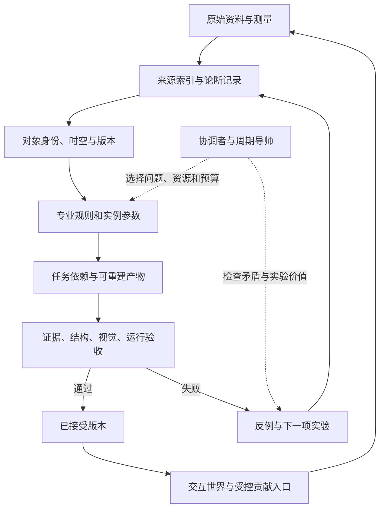

# Mother System：完整评审

## 1. 先给结论

**建议继续，下一轮先在现有生产任务中诊断一处反复出现的错误，再用有限试验验证修正、保存和复用。** 阶段目标是减少同类返工，让新证据正确影响相关产物，并观察方法在不同任务上的效果。具体试点与投入应依据实际资产、证据和阻塞状况决定。

这不是否定长期愿景。历史世界、地方知识保存和程序化生产可以共享一套证据体系；它们也需要各自的验收标准和推进节奏。把它们一开始全部绑成一个总工程，会让任何一处未完成都变成整个系统的障碍。

本次材料充分表达了愿景和问题，但未提供足够生产证据来判断全部 Mother 的实际水平。下文的系统性风险是对设计的评审，不是声称已经测出所有仓库的缺陷。

## 2. 应当保留的五个核心

| 应保留的方向 | 为什么有价值 | 需要补上的工程条件 |
|---|---|---|
| 时间、地点、对象身份 | 抑制把通用形象冒充地方或历史事实 | 增加单位、坐标系、适用范围、证据年代；未知可为空 |
| 观察、证据、假设、验证 | 给生成建立可追溯的出发点 | 每轮必须有可否证预测和外部检查结果 |
| 压缩后能回到细节 | 防止摘要越写越确定、例外逐渐消失 | 原件、定位、散列、版本、推导关系可访问 |
| 结构与环境关系 | 能把对象组合成有联系的世界 | 区分拓扑关系、连续场和时间事件；控制耦合成本 |
| 人与专业代理互补 | 人的地方知识、取舍与审美很重要 | 用固定对照和明确决策减少人反复纠正同一问题 |

这些方向分别见原包 `SYSTEM_CANON.md:23–43,81–106`、`WORLD_LEARNING_MODEL.md:21–35,84–155`。相邻成熟实践也支持其中部分做法：文化遗产可视化已有强调来源评估、记录和可持续访问的原则，不必从零发明研究纪律。[London Charter](https://londoncharter.org/principles.html)

真正可能形成项目优势的，是把地方证据、生成规则、修正记录和可交互对象接起来，并证明一条修正可以稳定影响后续产物。这是一项待验证的产品与工程优势，不能仅凭当前概念包宣称算法突破。

## 3. 需要澄清的八个概念

### 3.1 “学会了”需要观察得到的定义

建议区分四件事：查到了资料；把资料记入外部记录；修改了规则或工具；在未参与调参的新任务上表现更好。前两项不自动推出后两项。

普通修正先留下目标、关键依据、前后差异和结果；准备宣称某项方法可复用时，再补适用范围、反例和不同任务的迁移结果。没有迁移验证时，结论限于当前样本。不能因为一次修正没有迁移实验就否认它的价值，也不能把外部记录积累解释为底层模型权重已经被训练。

### 3.2 对象身份稳定，关于它的认识可修订

原包希望在身份确定后遵守相应约束，方向合理；但“resolved”不应成为永不重开的结论。照片中的水、湿石、冰或反光表面，可能需要新证据才能消歧。对象状态也可能包含混合相或随时间发生转变。

建议保存 `identity_hypothesis`、支持证据、反证和重开条件。当前采用的解释用于本轮计算；出现反证时，重新检查它并使依赖它的输出失效。保留互斥候选，不把它们平均成一个物理上不存在的对象。

### 3.3 事实、团队决策和流程状态应分开

`MEMORY_AND_HANDOFF_PROTOCOL.md:43–53` 把 `VERIFIED`、`ACCEPTED_CANON`、`SUPERSEDED` 放在同一列表。它们分别描述证据支持、团队采纳和版本生命周期；一个条目可以同时具有这三个属性。

建议至少拆成：认识状态、复核状态、生命周期、采用决策。比如“尺寸仍属推断，但团队允许用于远景原型”完全合理；不能把这次允许改写为“尺寸已验证”。原包中 FACT/INFERENCE 和 ESTABLISHED/PROPOSAL 等术语也应统一映射，避免不同 Mother 各自解释。

### 3.4 视觉相似、历史依据、结构合理与运行性能独立验收

一段屋面即使渲染漂亮，也可能搭接错误；即使有历史依据，也可能无法在目标设备运行。验收应采用多项门槛，关键失败不得靠别的分数补偿。

建议记录五个维度：证据适用性、几何与结构、材料与动态、视觉表现、运行成本。普通道具与近景历史主资产可以使用不同标准，但标准必须在生产前写明。原型通过与历史生产发布通过需要不同状态。

### 3.5 自我复查可以帮助发现问题，不能独立担保正确

更强的导师、多次对话和多个角色都不自动增加独立证据。共享同一错误材料的多个代理可能得到相同错误结论。

已有研究在特定推理任务上发现无外部反馈的自纠可能失效；另有研究通过专门强化学习改善自纠。这些结果不足以直接判定当前视觉任务的能力。项目应测自己的任务，而不是把早期论文结论永久化。[ICLR 2024 自纠研究](https://arxiv.org/abs/2310.01798)、[SCoRe](https://arxiv.org/abs/2409.12917)

建议把复核锚在测量、固定视图、独立原始来源、结构检查和人类盲评上。导师的职责是提出可检验的解释和实验，不是用更有说服力的文字替代实验。

### 3.6 学习成熟系统时，要保留术语和实现对照

`PUBLIC_TECH_KNOWLEDGE_MAP.md:7–15` 建议去掉产品命名，抽取一般规律。过度去名会丢失可检索性、边界条件和操作语义。建议同时保留“通用概念、原产品术语、版本、输入输出、失效条件、适配实现”。

可以自己定义世界知识层，同时直接使用成熟几何库、文件格式、渲染器和调度方法。外部工具并不天然污染世界模型；没有清楚的接口才更容易造成耦合。许可和使用限制留在来源与依赖记录中，不能因抽象而丢失。

### 3.7 生成规则不必替代所有网格、测量和局部残差

规则善于描述重复结构，测量善于保存某个真实实例的特殊性。把残差删掉、再用噪声补回来，可能得到同类对象，却失去原对象的信息。

建议采用“通用规则＋地方或型号配置＋实测约束＋实例修正”。不要求每个扫描对象都被压成一小段程序，也不把全部复杂度藏进一个未计费的大模型后声称数据只剩一个种子。精确恢复和有界近似分开，详见 [存储分析](06_DEM_AND_STORAGE.md)。

### 3.8 长期智能研究与近期生产应保持清楚边界

`MOTHER_REGISTRY.md` 同时列出瓦、门窗、生态和 AI Brain/Jarvis。它们属于不同成熟度的工程问题。建议近期把 Brain 限定为任务状态、检索、预算、实验选择和结果归档；自主认知、普适世界模型、复杂社会行为保留研究路线。

“每 12 小时开会”也应先作为协调策略试验，比较其成本与收益。可以保留 12 小时的检查窗口，但以结构化变更摘要为主；没有依赖冲突或需要决策的内容时，不必让所有 Mother 互相复述状态。

## 4. 推荐架构：共同证据，专业规则，独立验收

以下是逻辑职责划分，全部为建议。先复用已有文件、工具和工作流；只有实际查找、协作或重建问题需要时，再增加索引与服务。六个逻辑边界不要求建设六套平台。

### 4.1 六个边界

1. **原始证据库**保存照片、扫描、文档、测量、地图等原件和来源。OCR、裁切和转码是衍生物，不替换原件。
2. **论断与决定层**保存“谁基于什么，对哪个对象在何时提出了什么”。反证与支持证据均可查询。
3. **世界描述层**保存实例身份、部分、关系、事件、状态和所采用的假设版本。
4. **专业规则层**保存瓦作、木构、地貌、机械、物种等方法，明确输入、尺度、适用范围、未知参数和输出。
5. **构建层**把选定版本的数据与规则编译为场景、网格、材质、动画、碰撞和运行缓存。
6. **验收与发布层**记录测试与人工决定，并保持上一个已接受版本可回退。

小妈负责优先级、接口和冲突处理，不亲自维护所有领域事实，也不把所有中间产物挤进一段总摘要。Mother 是能力边界，可以由同一执行环境按任务调用；不需要每个名称都对应常驻代理。

### 4.2 不要把三种图混成一张

| 图 | 例子 | 处理原则 |
|---|---|---|
| 证据推导图 | 某尺寸结论来自测量及相机标定 | 保存原件、定位、矛盾与推导；可追踪来源失效 |
| 构建依赖图 | 瓦宽改变后，阵列、UV、碰撞和测试需重建 | 输入版本和参数决定缓存是否有效 |
| 世界关系图 | 瓦被何物支承；建筑遮挡风雨；人使用门 | 关系可能形成反馈；由适用的求解器和时间步处理 |

构建任务可组织为有向无环图；世界中的双向作用不应强行塞入同样的无环假设。Houdini PDG 值得借鉴的正是任务、依赖、属性和增量重算，而非单纯节点外观。[SideFX PDG](https://www.sidefx.com/docs/houdini/tops/intro.html)

### 4.3 最小技术选择

建议先复用现有版本控制、证据文件和少量结构化记录。实际出现反复找不到适用记录、跨任务查询或索引恢复需求时，可试用 SQLite 建可重建索引；不将新增数据库列为第一次修正的前置。若采用全文检索，要测试中文分词、别名、旧地名和编号；选了 FTS5 并不等于召回可靠。[SQLite FTS5](https://www.sqlite.org/fts5.html)

证据关系可参考 W3C PROV 的实体、活动、责任主体；历史事件可按需映射 CIDOC CRM；时空栅格来源索引可参考 STAC。不建议第一周完整实现三套标准。[PROV-O](https://www.w3.org/TR/prov-o/)、[CIDOC CRM](https://cidoc-crm.org/Resources/definition-of-the-cidoc-conceptual-reference-model-v7.1.1)、[STAC](https://github.com/radiantearth/stac-spec/blob/master/item-spec/item-spec.md)

资产创作与组合可在需要时适配 OpenUSD；运行交付按目标引擎使用 glTF/GLB 或其他产物。两者都不应单独承担全部知识记忆。OpenUSD 的层和变体适合非破坏组合；glTF 明确面向运行时资产交付。[OpenUSD](https://openusd.org/release/intro.html)、[glTF](https://www.khronos.org/gltf/)

先写小接口，把上述选择做成可替换适配器。避免同时新建图数据库、向量数据库、分布式调度器、世界编辑器和渲染引擎。

## 5. 把学习做成有停止条件的实验

### 5.1 一轮需要回答的十个问题

以下是思考顺序，可以合并在一页任务记录中。按本轮用途选择必要检查，不要求每次小修改都新增十份记录或运行整套生产验收。

| 步骤 | 必须留下的内容 | 离开此步的条件 |
|---|---|---|
| 定义目标 | 对象、用途、观察距离、时间地点、预算 | 成功与失败有具体含义 |
| 检索旧记录 | 相关决定、禁用旧路、已接受版本、例外 | 说明哪些记录适用于本任务 |
| 整理证据 | 来源、定位、测量、单位、年代和质量 | 事实与缺口可见 |
| 分解对象 | 大形、部分、连接、材料、状态 | 关键结构有独立描述 |
| 提出候选 | 关键歧义保留 2–3 种解释 | 每个候选有区分它们的观察 |
| 选择实验 | 本轮只改什么、预计出现什么 | 结果可能推翻当前方案 |
| 生成最小样本 | 固定输入、种子、版本和相机 | 可复现检查过程 |
| 比较与否证 | 指标、固定对照图、结构与运行检查 | 能定位失败层次 |
| 固化或回退 | 结论、失败路线、产物与接受状态 | 无证据的变化不覆盖已接受版本 |
| 迁移验证 | 一个未参与调参的不同对象或任务 | 判断规则是否具有超出单样本的收益 |

学习可以包含快速生成探索：它是在验证一个清楚标记的假设。原包“学习在生成之前”若被解释为必须完全理解领域后才动手，反而会拖慢获得反馈。

同一对象的留出视角适合检查多视一致性，但不能单独证明方法已经迁移到另一种对象。两种评测分别记录。

### 5.2 失败时先判断错在哪里

建议依次排查：目标理解 → 证据身份/年代 → 单位与相机 → 部分与连接 → 参数 → 材料与照明 → 导出与运行。诊断错误层级后再修改。镜头透视错误时增加几何细节，通常只是补偿错误。

停止当前路线的建议条件：出现硬约束反例；连续两次改动没有预先声明的新假设或新证据；连续三轮固定评测没有超出评测噪声的改善；超过本轮时间或成本预算；修复一处却重新引入已拒绝错误。停止后交付诊断、最佳保留版本和下一项能区分假设的实验，不能只留下“继续优化”。

这些阈值是首轮工作规则，应根据任务时长和评测波动调整。若缺证据，只阻断依赖该证据的真实性结论；不阻断无关的索引、相机工具或相对比例试验。

### 5.3 测量真正的积累

建议月度记录：同类错误复发次数；每件达到验收的总成本；人重复解释同一约束的次数；关键结论能追到原件的比例；新证据引发正确重建的比例；迁移到新样本后保持通过的数量。分母、任务难度和版本必须相同或注明差异。

知识条目数、会议次数、提示词长度、生成图片数都可以计费和排查流程，但不应作为学习成功的主要指标。

建议首月增加一个小型对照：对相近难度的任务分别使用现有流程、加入结构化历史记录的流程、再加入独立验收的流程；固定输入与预算，记录旧错复发、实际接受率和总成本。训练/调参样本与评测样本分开，并轮换任务顺序。这有助于判断改善是否与记忆、评测或额外计算有关。小样本、任务难度差异和模型随机性仍会限制归因，应报告这些因素；结果用于决定下一次实验，不作普遍能力排名。

## 6. 视觉观察与形状蒸馏

### 6.1 先诊断视觉错误的来源

检查、记忆和复核能提供反馈，不保证执行模型就能看懂或修好对象。对一个已有正确参照的失败样本，建议先区分：原始证据缺失；已有证据未检索到；相机/尺度不匹配；观察者看到了但解释错误；结构表示或生成工具表达不了；导出/渲染造成偏差。分别补证据、修检索、校准观察、加入明确测量或人工标注、修改表示/工具、排查运行转换。若只有专业人员或独立测量能判断某个关键点，就保留该检查接口，不继续依赖同一模型重复自评。

需要给观察提供可比较的输入：同一尺度、同一视角、同一照明，分别显示轮廓、深度、法线、构件编号和最终材质。用主视图判断大形，用背面、底面、剖面检查支承、厚度和连接。光照和纹理必须能够关闭。

本地瓦片样本提供了一个可考虑的起点，但尚未比较所有 Mother 的现有样本。2026-09-01 分析报告明确记录：真实比例未知，粗糙度没有直接依据，人工视觉和生产批准均为 false。本次查看了该报告及四视图，没有重新读取原 FBX。图像能提示重复曲面结构，但不能补出年代、真实厚度或安装规则。[随包保存的原分析报告副本](evidence/local_tiles_review_20260901.md)、[已有四视图副本](evidence/local_tiles_contact_sheet_20260901.png)

### 6.2 统一描述外壳，允许不同领域采用不同几何

建议共同描述包含：身份与适用范围、坐标与尺度、部分图、约束、生成方法、参数、局部残差、材料、动作状态和证据引用。内部表示按对象选择：

| 对象 | 优先表示 | 不能省略的部分 |
|---|---|---|
| 瓦、砖、梁、门窗 | 截面、扫掠/放样、厚度与装配参数 | 支承、搭接、端部、净空、制造和地方变体 |
| 建筑 | 构件与空间图、轴网、局部参数规则 | 承接关系、交通路线、不同年代的改建事件 |
| 飞机和机械 | 型号配置、零件关系、曲面与关节约束 | 实际安装语境、坐标、碰撞包络与运动范围 |
| 大部分地表 | 实测高度场、矢量水系、多尺度残差 | CRS、垂直基准、NoData、边界与测量误差 |
| 岩石、洞穴、悬垂 | 网格或隐式面/SDF、局部细节层 | 高度场不能表示的多值垂直结构 |
| 植物 | 分枝与生长图、种属参数、几何实例 | 物种、环境、季节和年龄适用范围 |
| 人和动物 | 骨架、皮肤/体形、动作与接触状态 | 生物比例、关节限制、支撑相和环境交互 |

统一一种几何原语覆盖所有领域，会损失各领域最重要的信息。几何算法可借鉴成熟库；稀疏体积可借鉴 OpenVDB；它们提供表达和计算工具，不负责证明重建为真。[libigl](https://libigl.github.io/)、[OpenVDB](https://www.openvdb.org/)

### 6.3 稀疏视图对应多个可检验三维假设

单张或少量图片通常无法唯一确定背面、内部和尺度。建议每次明确：哪些表面实际可见、哪些通过对称或制造假设补全、哪些仍未知。生成的多视图可以帮助表达候选，不构成新的实物观察。

有实拍条件时，优先补拍最能解决关键歧义的视角，附比例依据；不应仅增加相似正面照片。COLMAP 的文档也把足够重叠、不同观察位置和相机模型作为重建条件的重要部分。[COLMAP](https://colmap.github.io/tutorial.html)

### 6.4 评测应分层并保留测试样本

建议先做 6–12 个小样本的校准集，再留出未参与调参的样本。它们用于发现流程问题，不足以证明整个世界系统已经泛化。每个样本保存正确例、已知错误例和常见混淆例。

几何可使用关键点偏差、轮廓误差、厚度区间、穿透和接触检查；历史依据使用来源与适用范围检查；动态使用动作边界和时间段；运行使用帧时间、内存与加载测量。人评时固定画面、随机左右位置，可选“分不出”并标注具体错误区域。

相机未匹配、遮挡不同或参考带畸变时，不能机械套用像素差。LPIPS 等感知相似度可以作为辅助定位工具，不能证明构造或年代正确。[LPIPS 原作者项目](https://richzhang.github.io/PerceptualSimilarity/)

先用故意缩放某个比例、删除一处支承、修改一个材料通道的坏样本检查评测是否真能报警。如果它只会对新旧产物都说“不错”，暂时不宜接入自动接受流程。

## 7. 材料、物理和环境关系

### 7.1 材料分三层

**制作与结构**：基体、制造工艺、孔隙或纤维、层次、表面加工。**随时间变化的状态**：含水、积尘、裂损、修补、氧化或生长。**渲染参数**：颜色、法线、粗糙度等以及目标渲染器的映射。

这是推荐的数据设计。不能因为把它写成方程，就声称参数已获材料科学验证。PBR 资料适合学习光与表面的响应，不自动提供某种地方瓦材在多年风雨后的演化规律。[PBRT 第四版](https://www.pbr-book.org/4ed/contents)

建议用下述概念接口表示变化，不在没有数据时填造系数：

`下一状态 = 演化规则(当前状态, 环境输入, 暴露条件, 使用/维修事件, 时间步, 参数依据)`

`渲染参数 = 材料映射(结构, 当前状态, 观察尺度, 渲染器版本)`

“雨后更湿”的效果可以先实现为视觉近似，标明适用条件；若宣称物理模拟，就补充参数单位、初边值、量纲与守恒检查、数值稳定性及测量对照。三种成熟度建议分别叫“外观规则”“经样本校准的近似”“经相应实验验证的物理模型”。

### 7.2 共享机制，不共享一个万能旧化贴图

材料库可以共享积尘、暴露、雨淋和修补的接口；地方、工艺、涂层和物种特征放在不同配置中。色差不能直接等同于年代；年龄也不应成为让所有表面同步变旧的唯一旋钮。

一组图像可能同时受照明、反射、颜色和几何影响。反演工具可以帮助拟合，但需要控制条件；拟合成功并不唯一证明真实材料成分。[Mitsuba 3](https://mitsuba-renderer.org/)、[逆渲染教程](https://mitsuba.readthedocs.io/en/latest/src/inverse_rendering/forward_inverse_rendering.html)

建议先让同一片屋面的干燥、湿润、遮蔽、局部维修四种状态通过一致性检查，再扩展复杂生物附着与多年老化。

### 7.3 场、图、事件各自负责适合的事情

| 表达方式 | 合适用途 | 主要限制 |
|---|---|---|
| 连续场 | 湿度、温度、风速、光照、表面含水等空间量 | 必须说明单位、分辨率、边界和合成规则 |
| 关系图 | 支撑、包含、邻接、连接、使用和可通行性 | 关系本身不等于力学求解结果 |
| 事件与状态机 | 建造、维修、迁移、开门、破坏和复原 | 不能用连续平滑插值抹掉离散历史事件 |
| 个体行为模型 | 人或动物的目的、选择、接触和交互 | 密度场可作输入，但不足以完整描述意图 |

建议每类场指定一个权威生产者和统一坐标转换，防止 Weather 与 Material 各自计算“湿度”且含义不同。写明字段语义、单位、采样位置、时间步、误差和何时重算。主导影响先单向耦合；只有双向反馈确实影响验收时才加入迭代求解。

连续物理、离线缓慢老化和渲染帧率应解耦。不必每一帧计算每棵树对整个世界的生态影响。远近不同精度的仿真也需要边界过渡与状态保存。

## 8. 记忆怎样真正阻止复发

### 8.1 长期记忆应该能回答具体问题

“我们以前为什么否定这个方案？”“这条规定适用于哪个建筑支系？”“哪份原件支持这处结构？”“新证据使哪些产物过期？”“上一次被接受的是哪个版本？”

建议把原包七层记忆整理为独立对象：原始来源、观察、论断、决定、试验、版本化产物、当前任务状态。领域记忆与公共技术记忆是检索视图和适用范围，不必各自复制同一事实。

摘要是入口，原件和记录是依据。向量相似结果只作为候选；关键约束先按对象 ID、类型、地方、年代和版本确定性检索，再展开相关来源及反例。

### 8.2 决定必须有适用域和重开条件

旧失败记录应包含：当时输入、误解、失败检查、适用范围、替代方案、何种新证据允许重试。否则失败记忆会变成永久禁令，阻碍本来有效的不同场景。

建议 `canon` 主要保存价值与工程约定、经过审议的稳定决定。世界事实仍在可修订论断库中。新导师建议先进入候选决定，经过试验和采用记录，再成为团队约定；不要直接把此次评审压成不可争议的真理。

### 8.3 依赖失效比“提醒别忘记”更可靠

举例：某片瓦的宽度依据被纠正。系统应标出依赖该宽度的排列、屋面覆盖、UV、碰撞与验收结果过期，并重建相关任务；与它无关的门扇材质无需重建。

已接受产物保持不可变，新的候选产物另存。通过全部必要门槛后，才切换当前接受指针。缓存键需包含证据与规则版本、参数、随机数算法、工具链、构建设置等影响输出的因素。相同种子本身不足以保证跨版本一致。

对数值几何、渲染图像分别约定复现方式；浮点和 GPU 渲染未必跨设备逐字节相同。可要求相同语义结果和误差容限，不应伪造完全确定性承诺。

### 8.4 做两种恢复演练

第一次：从新会话仅凭交接包找回目标、旧决定、原始证据和最佳产物，并继续一个小修改。第二次：模拟索引丢失，从版本化记录重建索引。两种演练通过后，才有理由说记忆有助于持续工作。

同时记录记录时间与对象适用时间。例如 2026 年录入的证言可能描述 1944 年的修缮；后来发现年份有误时，保留“当时系统知道什么”的修订历史。

## 9. 历史世界与地理证据

### 9.1 1940 年代可以作为目标，但数据准备有成本

现代 DEM、SAR、OSM 和航片支持现代状态或较稳定地貌的推断，不能自动证明 1940 年代的道路、河岸和建筑形态。即使地貌大体稳定，也要检查采石、填挖、工程改线和灾害变化。

USGS 的 CORONA/ARGON/LANYARD 解密影像集合标明 1960–1972 年。因此它可以用于较晚时间切片或变化推断，不是 1940 年代同期证据。[USGS 集合说明](https://www.usgs.gov/centers/eros/science/usgs-eros-archive-declassified-data-declassified-satellite-imagery-1?qt-science_center_objects=0)

更贴合起点的导航包括 NARA 的战时外国航片和 JACAR 的亚洲历史档案。NARA 对日本军方航片集合的说明提到约 1933–1945 年的中国、东南亚及太平洋部分地区。这提供检索方向，尚不证明项目具体坐标有合适影像。[NARA](https://www.archives.gov/research/cartographic/aerial-photography/foreign-photography)、[JACAR](https://www.jacar.go.jp/english/about/outline.html)

ERA5 覆盖到 1940 年，能提供大尺度历史天气参考；其早期资料受观测稀疏等限制。把区域再分析插值到一座院落，不能因此称为当年该院落的实测雨量。[ECMWF 说明](https://www.ecmwf.int/en/newsletter/175/news/era5-reanalysis-now-available-1940)

### 9.2 融合不是把所有图层叠在一起

建议先做来源卡，再做时空对齐，最后比较论断。卡片至少记录：对象适用日期、采集日期、分辨率、精度依据、水平和垂直基准、NoData、处理史、覆盖范围和使用条件。

旧地图配准必须报告控制点和残差；不能为了贴合现代底图任意拉伸重要结构。SAR 的亮度也不能直接当成表面高度。侧视雷达的叠掩和阴影可能使某些地区没有可恢复观测，地形校正不等于找回全部信息。[ASF SAR 指南](https://hyp3-docs.asf.alaska.edu/guides/introduction_to_sar/)

同一原始照片被十篇文章转载，仍然主要是一条来源链。保存共同原始来源标识；不以链接数量冒充独立证据数量。

### 9.3 冲突按论断管理，缺失保持缺失

不同日期的照片可能对应维修前后，不一定互相矛盾；真正冲突的解释可以作为互斥版本共存。需要公开一个完整画面时，应说明采用了哪一方案，并为缺证区域保留可查询标记。

支持历史时间切片，不等于从现代状态倒放一次物理模拟就能找回真实历史。建议依靠证据快照、离散事件和有适用范围的变化规则组合；缺失时期保留候选，不能假定所有维修、替换或侵蚀过程都可逆且已知。

建议区分“有直接证据的部分”“依据明确规则的推断”“为体验补全的内容”。不必让所有用户一直看到技术标注，但要能点开对象查看重要依据、时间和主要未知项。

## 10. 公共知识贡献

开放参与可以较早开始，小范围、有人复核的试点比一次性开放整个世界更合适。贡献的最小单位建议是一项可定位的来源或论断，而非一份无法拆解的大故事。

接收流程建议为：提交原件及说明 → 验证来源可追踪 → 拆出观察和解释 → 检查年代、位置和同源转载 → 专业复核 → 记录采用或争议 → 更新相关对象。可信贡献者也可能记错具体日期；不把个人信誉直接等同于所有论断正确。

对地方工艺，优先保存原始术语、连续过程、工具和尺度、手势及失败做法，再附摘要和翻译。适合请当地匠人判断工艺、历史研究者判断年代、材料人员判断状态，分别记录审查范围。一个人不必给整个对象的所有属性背书。

原包贡献字段已有基础。建议补充原件散列与定位、适用时间/记录时间、可见范围、支持与反对的论断 ID、来源同源组、撤回与替代关系，以及贡献者允许怎样展示和使用。对口述者和社区提出的访问限制，保留在来源记录和发布流程中。这里是工作协议建议，不是对某项具体资料权利的法律结论。

不要默认让公开贡献直接改生成规则或项目 canon。附带文字，包括要求忽略规则或运行命令的内容，均是待分析材料；实际执行仍应来自已授权任务和受控工具入口。

## 11. 建议把第一轮样板选得更小

**先从已有生产任务中选择试点。瓦片是当前可见的候选，尚不能认定为全系统最优选择。** 建议小妈用现有清单快速比较候选的来源可取得性、验收依据、当前返工问题、修改范围和跨能力依赖。若瓦片合适，再完成“有限屋面样片：证据 → 结构描述 → 参数化变化 → 材料状态 → 固定验收 → 新证据修正 → 另一类任务复用”。

这条链涉及 Architecture、Tiles、Material 和一个明确的环境输入接口，能暴露尺度、支撑、记忆、材质、依赖和视觉评测问题。第一周不必同时接入实时 Weather、Ocean、人物和飞机。

这个选择基于本次能看到的本地资料，不代表它已被证实是所有项目中最成熟的资产。若协调端另有来源与验收更完整的样本，应按同样条件替换。

第一阶段保持样本自身真实的证据年代；未知就记录未知。先验证方法，不要把现代瓦片资料直接设为某年某处的历史屋面。进入 1940 年代示范时，再选择资料最齐全的一个明确地点和有限时间窗口。

首次小试验的目标是：抓住一个有明确正确参照的错误，完成修正并保存可恢复版本；有适用的依赖案例时，再验证证据变更怎样影响产物。完成时间由实际任务与资源决定。单次通过只验证相应案例，不能据此宣称整体学习系统已经成熟。

## 12. 项目最值得坚持的长期方向

建议把最终产品看成一个可以被追问和被修正的数字世界：用户能看见对象，也能找到对象背后的依据；新的地方知识能改变明确的部分；方法在别的对象上成功迁移时，系统才获得一项经过验证的新能力。

这需要持续的证据工作、明确的专业边界和可重复生产。下一轮导师咨询最有价值的输入，应当是几次带失败样例和可复现结果的实验，而不仅是更长的原则文档。
