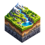

  

# KAOPU Geography R17

This publication adds only an isolated geography-workbench directory and its scoped QA workflow. Other hosted projects are untouched.

RME4 Crater remains a separate original entry. Underwater Crater uses the inherited implicit field with inverse-coordinate scaling: X/Z = 2/3, vertical distances = 2, pivot y = 2.1 in the source coordinate system. It is not a replacement blue-hole mesh. Sea height is 3.1 in source units. The shader uses the same original noise and scene() equations, with separate clear-water display and inspection cameras. No unit conversion to surveyed meters is claimed.

Seven entries: Endless Cave, Layered Relief, Cave Passage II, Desert Canyon 2017, RME4 Crater, Underwater Crater, Snow Fractal Ridge. Persistent DOM navigation; only one active render. Drag/zoom and view/ratio controls apply to the new underwater entry. Teacher video does not drive the simulation clock.

The web edition is a lightweight deployment. Reference recordings and experimental replacement textures remain in the conversation's complete companion package. Local video can be opened in the optional reference panel. The canyon loads the original public channel images rather than substitutes.

## Brand mark

The selected terrain-production icon is stored in `brand/` and appears at the front of the overview workbench and as the browser icon. This branding layer does not modify any scene shader, geometry, material, grain, camera path, or interaction logic.

## Sources and rights
- Moon Surface II, Nikos Papadopoulos / 4rknova, 2015, Creative Commons Attribution-NonCommercial-ShareAlike 3.0. https://www.shadertoy.com/view/4tlXzr
- Desert Canyon, Shane. Log-Bisection Tracing by nimitz / stormoid, Creative Commons Attribution-NonCommercial-ShareAlike 3.0. https://www.shadertoy.com/view/Xs33Df and https://www.shadertoy.com/view/4sSXzD
- Desert Passage II: user-provided Image/Common/Cube A source. Includes David Hoskins Hash without Sine, Creative Commons Attribution-ShareAlike 4.0, and attributed IQ, Fabrice, Tomkh, Alex Evans / Dave Smith / Media Molecule techniques retained in the complete source archive.
- RME4 Crater: user-provided source and recording. Original authorship is not transferred to KAOPU by this port.
- Snow Fractal Ridge: David Lovera / Unix, 2015, based on Kali, Creative Commons Attribution-NonCommercial-ShareAlike 3.0.

This is a shader-learning and derived-study workbench; renaming or changing the environment does not remove original license restrictions. Original commented sources are retained in the accompanying package. No commercial authorization is asserted.

## Verification
`qa_public.py` targets the deployed HTTPS page using a real Chromium WebGL2 implementation and records actual render/interaction outcomes. Mobile coverage is an emulated viewport, not physical-phone testing. Results must be read from the workflow artifact, not assumed from the presence of this script.

## Seventh terrain: Endless Cave

BoyC, The Cave (https://www.shadertoy.com/view/MsX3RH), CC BY-NC-SA 3.0 (https://creativecommons.org/licenses/by-nc-sa/3.0/). User-provided shader preserved byte-for-byte at `sources/endless/original.frag`; provenance and exact channel hashes at `sources/endless/provenance.json`. This is an inverse-square potential field traced at fixed steps, not a true SDF or Perlin-noise reconstruction. Camera, light path, field constants, grain, mirrored triplanar samples and original step counts are unchanged. No commercial license is asserted. The private user reference video is not hosted.

## O1: original teacher study correction

The seven original R17 runnable scenes and runtime remain byte-identical. The independent replacements08/09/10 have been withdrawn from the main catalog and script-loading list; their earlier files remain archived rather than deleted.

Three original-study entries lead to the shared, self-authored local-import container at `teacher-original/index.html?case=08`, `?case=09`, and `?case=10`. The public container contains only UI, runtime wrappers, integrity pins, and attribution. It contains no teacher shader body, original texture bytes, original audio, or pre-rendered teacher image. Before import it explicitly states that no original study pack has been loaded. The card icon represents a local file, not a completed render.

The user privately retains exact original HTML/JSON study packs. The browser parses an imported HTML only as data, checks original source bytes, each original texture, dimensions and individual sampler settings, and then compiles the source unchanged inside a uniform/entry wrapper. Imported content stays in browser memory; the container makes no upload/fetch request. Original author rights are not replaced by the container's authorship.

-08: Canyon — Inigo Quilez, https://www.shadertoy.com/view/MdBGzG
-09: Manta Ray v2.0 — dakrunch, https://www.shadertoy.com/view/4ls3zM
-10: Boaty Goes Caving — David Hoskins, https://www.shadertoy.com/view/ldBBDm

Verification scope: original-source/image integrity and private EGL renders exist. The public correction checks the container UI, navigation, invalid local-file rejection and no network submission, plus the unchanged original seven scene regressions. It does not claim real-browser reproduction of the imported teacher shaders; that private verification remains blocked by the available execution environment. UI-only success must not be presented as completed teacher rendering.
