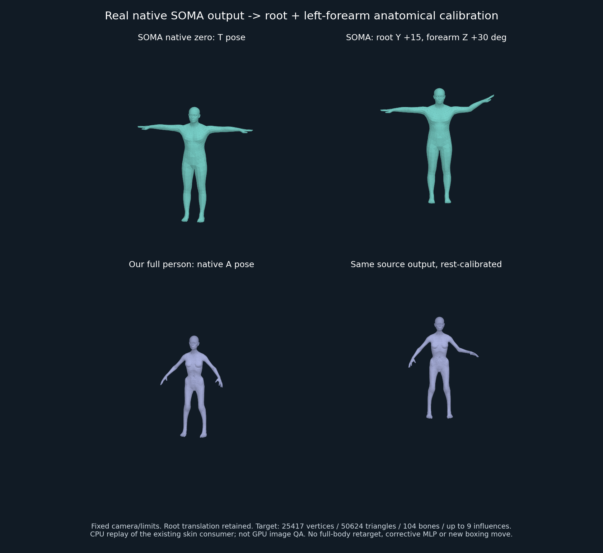

# SOMA 原生输出 → 104骨最小解剖标定 R01

2026-10-09。这里第一次把**真实官方 SOMA CPU 输出**转换成现有完整人物的原生 pose，并通过现有蒙皮消费口验证。范围仅 root 与左前臂，尚不是完整77→104重定向，也没有新增拳击招式。

## 实测与失败门禁

- 官方SOMA0.3.3 native low，12个独立诊断姿势：零姿、前臂XYZ各±10°、root平移、root三轴+10°、root与前臂组合。它们不是连续动作clip。
- 源有符号XYZ旋转与独立Rodrigues矩阵比较，最大元素差6.17e-7。
- 现有36个R02形体 × 12源姿势 = 432例：保留104骨；root旋转最大差5.93e-8，前臂局部旋转差1.50e-6，规范化腕方向差7.02e-8，骨长差1.20e-8米。所有容差和原始数值以RETARGET-QA.json为准。
- 六个完整CommonPerson（两儿童及四成人体型）实际驱动AnimatedHuman：每个25417顶点、50624面、全部原生CSR最多9影响。root平移最大误差1.86e-7米；组合姿势旋转差2.17e-6；不受前臂影响的表面扣除root刚体运动后误差1.60e-7米，受前臂影响表面有实际运动。
- 以上完整皮肤结果是现有Float32纹理/CSR算法的CPU回放，不是GPU帧缓冲读回；没有重新宣称动态颈部校正等效。
- 映射拒绝其他源关节旋转、源rest/骨段平移变化、非刚体/NaN矩阵、错误形体fingerprint、非恒等virtualRoot和非原生identity target root。独立审查用“吞掉root.rotation”变异确认root旋转断言会失败。

## 不能直接抄角度：T姿和A姿不同

源：SOMA Y-up、+Z前向、米、轴角弧度；目标：Anny Z-up、-Y前向、米、local-ref rotvec度。行优先矩阵作用于列向量。

1. 正旋转坐标变换C将(x,y,z)映为(x,-z,y)，行列式+1，无镜像。
2. 从真实源零姿与每个目标形体rest各取“肘→腕”作为纵轴；取“食指MCP−小指MCP”投影后的掌侧向作为第二轴，再叉积出第三轴。源用LeftHandIndex2/Pinky2，目标用finger2-1.L/finger5-1.L。
3. Q = targetBasis × sourceBasis转置，把源T姿解剖基对齐到目标A姿。Q是每形体独立计算的正旋转。
4. 原生输出含公共世界transform。先求各关节相对零姿的worldDelta，再用parentDelta转置消除父级运动。前臂局部delta转换坐标后做Q × delta × Q转置；root只做C共轭，不套手臂Q。
5. 输入现有Anny local-ref旋转向量度。root平移已进入原生骨矩阵，只加一次；不逐帧bbox落地、不重新归零、不按身高改写源轨迹。

## 解剖对应与未映射项

| 源 | 目标 | 本次策略 |
|---|---|---|
| virtual Root | 无控制骨 | 必须恒等，不当作Hips |
| Hips | root | 只迁移相对原生rest的全局旋转与米制位移 |
| LeftForeArm | lowerarm01.L | 以上述解剖rest基转换局部运动 |
| 源内部forearm twist | lowerarm02.L | 未进行分配；目标局部保持identity，随前臂父级继承运动 |
| LeftHand | wrist.L | 用作腕点测量；不迁移独立手腕关节动作 |
| 其他源公共关节 | 其余目标骨 | 禁止源独立articulation；目标102个未映射局部输入保持identity |

两套骨架不是等长数组：公共SOMA77 pose/78 transform、此native procedural模型内部110骨，以及Anny104骨分别有不同职责。SOMA `layer.parents`在这里是内部层级，已用官方`public_joint_parent_ids`导出公共表，错误110表有负向测试。未来脊柱3段对Anny5段、twist拆分、掌骨/指节/趾节差异必须逐组标定，不能以改名、截断、补零声称全身迁移。未映射局部identity不等于冻结世界位置：它们正常继承祖先运动。

## 使用与复跑

读取无损 `SOURCE-DIAGNOSTIC.json.gz.b64`：base64解码后gunzip，是12个实际解析模型输出，完整保留公共骨和原生输入。它不是原模型权重或人物原网格资产。解压SHA256固定为`81b094daab294101aa19c77a2a0bcd26675a7c5645991076998b2f4ffa92c12a`；来自自有诊断输入与已核Apache-2.0 native资源。

```sh
node motion-architecture/soma-retarget-r01/test-retarget.mjs
node motion-architecture/soma-retarget-r01/test-full-consumer.mjs
```

前者仅需既有Anny资产，后者通过现有full/boxing/tests/load-model.mjs校验并读取既有人物资产。可用BOXING_OFFLINE=1拒绝既有GNM远程回退。重跑官方源需前一阶段隔离Python环境和三原生资产：

```sh
python export_source.py --assets /absolute/native-assets --cache /writable/warp-cache --output SOURCE-DIAGNOSTIC.json
```

导出脚本禁用HF联网并检查三资产hash，使用官方包0.3.3。发布版本已实际重跑，输出与原始fixture逐字节一致。校准器需`sourceNames/sourceParents/sourceZeroTransforms`及当前完整target names/parents/restMatrices/restFingerprint；convert时再传expectedRestFingerprint。调用方应**替换**本次诊断pose字典而不是和旧姿势合并，示例见完整消费测试。默认生产动作库仍拒绝这些独立诊断姿势，它们没有semanticMotionId、交互时序或质量认证。

## 实际网格可视对照



上排为官方native low输出，下排为既有完整CommonPerson的真实CSR消费结果。两列使用固定相机/坐标范围；右列保留根位移，未重置到地面。源T姿与目标A姿保留，左前臂围绕解剖校准基弯曲；目标头、另一只手、体型和拓扑未被替换。此图是CPU导出网格的Matplotlib静态渲染，不是网页GPU截图。

复图：export_source.py的`--preview source-preview.npz`保留实际源网格；运行完整消费测试时`RETARGET_PREVIEW_DIR`指向本目录，保存目标网格；再执行render_comparison.py。中间原网格只在本地，不随本目录发布。

## 后续还缺什么

- 全身与双手/脚趾映射、twist分配、跨身份源动作验证、速度/接触/物理约束未做。
- 六个完整网格的数值检查不等于所有36形体的GPU视觉验收。
- 现有形态、皮肤、骨架和旧预设完全保留；本模块不改变主台默认动作。
- Kimodo官方CPU路径已核实，但默认8B文本编码器超过本机RAM且需门控访问。具体条件见KIMODO-CPU-FEASIBILITY.md；未运行Kimodo推理、未下其权重。官方旧30骨预生成例可做私有文件研究，逐例再分发许可未明确，不随本目录复制。
